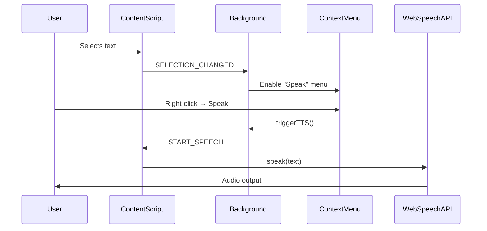

# TTS Chrome Extension: Complete Technical Guide

## Table of Contents
1. [Architecture Overview](#architecture-overview)
2. [Core Components](#core-components)
3. [Communication Flow](#communication-flow)
4. [Text-to-Speech Engine](#text-to-speech-engine)
5. [State Management](#state-management)
6. [User Interaction Flow](#user-interaction-flow)
7. [Advanced Features](#advanced-features)
8. [Error Handling & Recovery](#error-handling--recovery)
9. [Performance Optimizations](#performance-optimizations)

## Architecture Overview

The TTS Chrome Extension follows Chrome's Manifest V3 architecture with four main components:

```
┌─────────────────┐     ┌─────────────────┐     ┌─────────────────┐
│  Background     │────▶│  Content        │────▶│  Web Speech     │
│  Service Worker │◀────│  Script         │◀────│  API            │
└─────────────────┘     └─────────────────┘     └─────────────────┘
         ▲                       ▲
         │                       │
         └───────┬───────────────┘
                 │
         ┌───────▼───────┐
         │    Popup      │
         │    UI         │
         └───────────────┘
```

### Key Design Principles

1. **Separation of Concerns**: Each component has specific responsibilities
2. **Message-Based Communication**: Components communicate via Chrome's messaging API
3. **State Centralization**: Background script maintains authoritative state
4. **Progressive Enhancement**: Extension works immediately, voices load asynchronously
5. **Robust Error Recovery**: Automatic reconnection and state reconciliation

## Core Components

### 1. Background Service Worker (`src/background/index.ts`)

The brain of the extension - manages global state and coordinates all components.

**Key Responsibilities:**
- **State Management**: Maintains TTS state (playing/paused/stopped)
- **Voice Management**: Handles voice enumeration and selection
- **Context Menus**: Creates and manages right-click menu options
- **Message Routing**: Routes messages between components
- **Tab Navigation**: Stops TTS when tabs change/close
- **Settings Persistence**: Saves user preferences

**Key Classes:**

```typescript
class TTSManager {
  // Core TTS state management
  private isActive = false;
  private isPaused = false;
  private currentTabId: number | null = null;
  
  // Handles START_TTS, STOP_TTS, PAUSE_TTS, etc.
  async handleMessage(request: Message, sender: MessageSender): Promise<Response>
}

class SelectionManager {
  // Tracks text selection across tabs
  private currentSelection: SelectionData | null = null;
  
  // Updates context menu based on selection
  updateSelection(selectionData, tab): void
}

class ContextMenuManager {
  // Manages right-click menu
  private speakMenuId = 'tts-speak';
  private stopMenuId = 'tts-stop';
  
  // Updates menu state based on TTS state
  updateMenuState(hasSelection: boolean): void
}
```

### 2. Content Script (`src/content/index.ts`)

Injected into every web page - handles DOM interaction and Web Speech API.

**Key Responsibilities:**
- **Text Selection**: Monitors and captures text selection
- **Speech Synthesis**: Uses Web Speech API for actual TTS
- **Keyboard Shortcuts**: Handles Ctrl+Shift+Space, etc.
- **Visual Feedback**: Shows notification toasts
- **Page Reading**: Extracts full page text

**Key Classes:**

```typescript
class TextSelectionHandler {
  private speechSynthesizer: SpeechSynthesizer;
  
  // Monitors selection changes
  handleSelectionChange(): void
  
  // Handles TTS commands from background
  handleStartSpeech(data): Promise<void>
  handleStopSpeech(): void
  handleTogglePauseSpeech(): void
}

class ContentScriptController {
  // Main controller for content script
  private textSelectionHandler: TextSelectionHandler;
  
  // Initializes and coordinates components
  initialize(): Promise<void>
}
```

### 3. Popup UI (`src/popup/index.ts`)

The user interface - provides controls and status display.

**Key Responsibilities:**
- **Status Display**: Shows current TTS state
- **Playback Controls**: Play/Pause/Stop buttons
- **Voice Selection**: Dropdown for voice choice
- **Speed Control**: Slider and preset buttons
- **Volume Control**: Slider with domain-specific settings
- **Test Area**: Text input for testing voices

**Key Class:**

```typescript
class PopupController {
  private ttsState = {
    isPlaying: false,
    isPaused: false,
    currentText: ''
  };
  
  // Updates UI based on state changes
  updateTTSUI(): void
  
  // Handles user interactions
  handlePlayPause(): Promise<void>
  handleVoiceChange(): Promise<void>
}
```

### 4. Speech Synthesizer (`src/common/speech-synthesizer.ts`)

Wrapper around Web Speech API - provides robust TTS functionality.

**Key Features:**
- **Automatic Chunking**: Splits long text into manageable pieces
- **State Tracking**: Maintains playback state
- **Error Recovery**: Handles API quirks and errors
- **Voice Management**: Enumerates and manages voices
- **Progressive Loading**: Works immediately, enhances as voices load

```typescript
class SpeechSynthesizer {
  private isPlaying = false;
  private isPaused = false;
  private currentUtterance: SpeechSynthesisUtterance | null = null;
  
  // Main speech method
  async speak(text: string, options?: SpeechSettings): Promise<void>
  
  // Playback control
  pause(): boolean
  resume(): boolean
  togglePause(): boolean
  stop(): void
}
```

## Communication Flow

### 1. Starting TTS from Selection



### 2. Message Types

The extension uses typed messages for communication:

```typescript
enum MessageType {
  // Selection management
  SELECTION_CHANGED = 'SELECTION_CHANGED',
  SELECTION_CLEARED = 'SELECTION_CLEARED',
  GET_SELECTION = 'GET_SELECTION',
  
  // TTS control
  START_TTS = 'START_TTS',
  STOP_TTS = 'STOP_TTS',
  PAUSE_TTS = 'PAUSE_TTS',
  RESUME_TTS = 'RESUME_TTS',
  TOGGLE_PAUSE_TTS = 'TOGGLE_PAUSE_TTS',
  
  // State updates
  TTS_STATE_CHANGED = 'TTS_STATE_CHANGED',
  
  // Voice management
  GET_VOICE_DATA = 'GET_VOICE_DATA',
  SELECT_VOICE = 'SELECT_VOICE',
  UPDATE_VOICE_DATA = 'UPDATE_VOICE_DATA',
  
  // Speed control
  SET_SPEED = 'SET_SPEED',
  INCREMENT_SPEED = 'INCREMENT_SPEED',
  DECREMENT_SPEED = 'DECREMENT_SPEED',
  
  // Volume control
  SET_VOLUME = 'SET_VOLUME',
  TOGGLE_MUTE = 'TOGGLE_MUTE',
  UPDATE_TTS_VOLUME = 'UPDATE_TTS_VOLUME'
}
```

### 3. State Synchronization

State flows from background → content script → popup:

1. **Background** maintains authoritative state
2. **Content Script** reports playback events
3. **Popup** reflects current state
4. All components listen for `TTS_STATE_CHANGED` messages

## Text-to-Speech Engine

### 1. Speech Synthesis Flow

```typescript
// In SpeechSynthesizer
async speak(text: string, options: SpeechSettings): Promise<void> {
  // 1. Prepare for speech (stop any current)
  await this.prepareForSpeech();
  
  // 2. Preprocess text (handle URLs, abbreviations)
  const processedText = this.preprocessText(text);
  
  // 3. Chunk if needed (max 200 chars per chunk)
  const chunks = this.chunkText(processedText);
  
  // 4. Speak chunks sequentially
  if (chunks.length === 1) {
    return this.speakChunk(chunks[0], options);
  } else {
    return this.speakChunks(chunks, options);
  }
}
```

### 2. Voice Selection

Voices are enumerated in order of preference:
1. Content script attempts enumeration
2. Popup attempts enumeration
3. Background stores and distributes

```typescript
// Voice priority selection
private selectDefaultVoice(voices: SpeechSynthesisVoice[]): Voice {
  const englishNative = voices.find(v => v.lang.startsWith('en') && v.localService);
  const english = voices.find(v => v.lang.startsWith('en'));
  const systemDefault = voices.find(v => v.default);
  
  return englishNative || english || systemDefault || voices[0];
}
```

### 3. Chunking Strategy

Long text is intelligently chunked:
- Sentence boundaries preferred
- Max 200 characters per chunk
- Very long sentences split by words
- Maintains natural speech flow

## State Management

### 1. TTS State Model

```typescript
interface TTSState {
  isActive: boolean;      // Currently speaking or paused
  isPaused: boolean;      // Specifically paused
  currentTabId: number;   // Tab where TTS is active
  currentText: string;    // Text being spoken
}
```

### 2. State Transitions

```
         ┌─────────┐
         │ STOPPED │
         └────┬────┘
              │ START_TTS
         ┌────▼────┐
         │ PLAYING │◀──────┐
         └────┬────┘       │ RESUME
              │ PAUSE      │
         ┌────▼────┐       │
         │ PAUSED  ├───────┘
         └────┬────┘
              │ STOP
         ┌────▼────┐
         │ STOPPED │
         └─────────┘
```

### 3. State Validation

The extension validates state consistency:

```typescript
// In state-validator.ts
export function validateTTSState(state: TTSState): boolean {
  // Can't be paused without being active
  if (state.isPaused && !state.isActive) return false;
  
  // Must have tab ID when active
  if (state.isActive && !state.currentTabId) return false;
  
  return true;
}
```

## User Interaction Flow

### 1. Context Menu Flow

```typescript
// User right-clicks selected text
1. ContextMenuManager receives click event
2. Validates selection exists
3. Sends START_TTS to background
4. Background routes to content script
5. Content script starts speech synthesis
```

### 2. Keyboard Shortcuts

```typescript
// Keyboard handler in content script
handleKeyDown(event: KeyboardEvent) {
  // Ctrl+Shift+S - Start TTS
  if (event.ctrlKey && event.shiftKey && event.key === 's') {
    this.handleStartTTSShortcut();
  }
  
  // Ctrl+Shift+Space - Toggle pause
  if (event.ctrlKey && event.shiftKey && event.key === ' ') {
    this.togglePauseTTS();
  }
  
  // Ctrl+Shift+X - Stop TTS
  if (event.ctrlKey && event.shiftKey && event.key === 'x') {
    this.handleStopTTSShortcut();
  }
}
```

### 3. Popup Controls

The popup provides visual controls that map to background commands:

```typescript
// Play/Pause button
async handlePlayPause() {
  if (this.ttsState.isPaused || this.ttsState.isPlaying) {
    await chrome.runtime.sendMessage({
      type: MessageType.TOGGLE_PAUSE_TTS
    });
  }
}
```

## Advanced Features

### 1. Domain-Specific Volume

```typescript
// VolumeControlService tracks per-domain settings
class VolumeControlService {
  private domainVolumes: Map<string, number> = new Map();
  
  async getEffectiveVolume(domain: string): Promise<number> {
    return this.domainVolumes.get(domain) || this.globalVolume;
  }
}
```

### 2. Speed Control

Speed can be adjusted in real-time:
- Range: 0.5x to 3.0x
- Presets: 0.75x, 1x, 1.25x, 1.5x, 2x
- Live adjustment during playback

### 3. Reading Time Estimation

```typescript
calculateReadingTime(characterCount: number, speed: number) {
  const baseWPM = 150; // Average words per minute
  const avgWordLength = 5;
  
  const words = characterCount / avgWordLength;
  const minutes = words / (baseWPM * speed);
  
  return this.formatReadingTime(minutes);
}
```

### 4. Voice Preview

Users can preview voices before selection:

```typescript
// Preview in popup
async playVoicePreview(voice: VoiceInfo): Promise<void> {
  const previewText = this.getPreviewText(voice.lang);
  const utterance = new SpeechSynthesisUtterance(previewText);
  utterance.voice = voice;
  speechSynthesis.speak(utterance);
}
```

## Error Handling & Recovery

### 1. Connection Recovery

Content scripts automatically reconnect to background:

```typescript
private async attemptReconnection(): Promise<void> {
  try {
    // Ping background
    const response = await chrome.runtime.sendMessage({ type: 'PING' });
    
    if (response?.pong) {
      this.isDisconnected = false;
      this.processQueuedMessages();
    }
  } catch (error) {
    // Exponential backoff retry
    const delay = Math.min(100 * Math.pow(2, this.attempts), 5000);
    setTimeout(() => this.attemptReconnection(), delay);
  }
}
```

### 2. Speech Error Handling

```typescript
private handleSpeechError(error: SpeechSynthesisErrorEvent) {
  // Categorize error
  const errorType = this.categorizeError(error);
  
  switch (errorType) {
    case 'interrupted':
      // Expected when stopping - ignore
      break;
    case 'network':
      // Retry with offline voice
      this.retryWithOfflineVoice();
      break;
    case 'voice-unavailable':
      // Fall back to default voice
      this.useDefaultVoice();
      break;
  }
}
```

### 3. State Recovery

The extension recovers from inconsistent states:

```typescript
// Reconcile API state with internal state
private reconcileState(): void {
  const apiState = {
    speaking: speechSynthesis.speaking,
    paused: speechSynthesis.paused
  };
  
  // Align internal state with API reality
  if (!apiState.speaking && !apiState.paused) {
    this.isPlaying = false;
    this.isPaused = false;
  }
}
```

## Performance Optimizations

### 1. Lazy Voice Loading

Voices load asynchronously without blocking:

```typescript
constructor() {
  // Initialize immediately
  this.initializeSync();
  
  // Load voices in background
  this.loadVoicesAsync();
}
```

### 2. Debounced Updates

Rapid state changes are debounced:

```typescript
// Speed slider updates
private scheduleSpeedUpdate(speed: number) {
  clearTimeout(this.speedUpdateTimeout);
  
  this.speedUpdateTimeout = setTimeout(() => {
    chrome.runtime.sendMessage({
      type: MessageType.SET_SPEED,
      data: { speed }
    });
  }, 150); // 150ms debounce
}
```

### 3. Message Queuing

Important messages queue during disconnection:

```typescript
private messageQueue: Message[] = [];

private shouldQueueMessage(message: Message): boolean {
  const importantTypes = [
    MessageType.START_SPEECH,
    MessageType.STOP_SPEECH,
    MessageType.SELECTION_CHANGED
  ];
  return importantTypes.includes(message.type);
}
```

### 4. Efficient Text Processing

Text is preprocessed once and chunked intelligently:

```typescript
// Chunk reuse for pause/resume
private pausedChunks: string[] = [];
private currentChunkIndex: number = 0;

resume() {
  // Continue from saved position
  this.processQueue(this.currentChunkIndex);
}
```

## Security Considerations

### 1. Content Security Policy

The extension follows strict CSP:
- No inline scripts
- No eval() usage
- Sanitized user input

### 2. Permission Model

Minimal permissions requested:
- `activeTab`: Only current tab access
- `storage`: Save preferences
- `contextMenus`: Right-click menu
- `tts`: Text-to-speech API

### 3. Message Validation

All messages are validated:

```typescript
// Type-safe message handling
switch (message.type) {
  case MessageType.START_TTS:
    if (!message.payload?.text) {
      throw new Error('No text provided');
    }
    break;
}
```

## Debugging Tips

### 1. Enable Debug Logging

```typescript
// Set NODE_ENV=development
const debugLog = (...args) => {
  if (process.env.NODE_ENV === 'development') {
    console.log('[TTS-Debug]', ...args);
  }
};
```

### 2. State Inspection

```javascript
// In console
chrome.runtime.sendMessage({type: 'GET_TTS_STATE'}, console.log)
```

### 3. Voice Testing

```javascript
// Test voices directly
speechSynthesis.getVoices().forEach(v => console.log(v.name))
```

## Summary

The TTS Chrome Extension is a sophisticated system that:

1. **Separates Concerns**: Each component has clear responsibilities
2. **Handles Errors Gracefully**: Automatic recovery and fallbacks
3. **Optimizes Performance**: Lazy loading and debouncing
4. **Provides Rich Features**: Speed, volume, voice selection
5. **Maintains Consistency**: Centralized state management

The architecture ensures reliability, performance, and extensibility while providing a smooth user experience for text-to-speech functionality across any website.