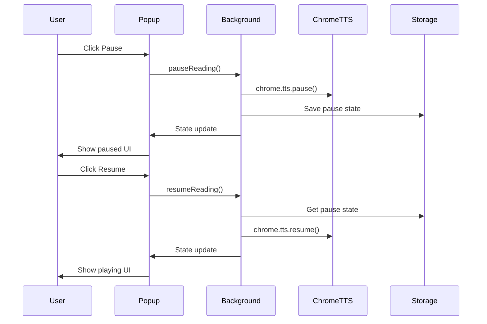

# Feature Specification: Pause/Resume Functionality

**Feature ID**: FEATURE-PAUSE-RESUME  
**Version**: 1.0  
**Last Updated**: 2025-07-02  
**Status**: DRAFT  
**Priority**: HIGH  
**Estimated Effort**: 3-5 days  

## 1. Feature Overview

### 1.1 Description
The Pause/Resume functionality enables users to temporarily halt text-to-speech playback and continue from the exact point where they paused. This feature provides essential playback control, allowing users to manage their listening experience without losing their position in the text.

### 1.2 Business Value
- **Enhanced User Control**: Users can interrupt playback for external interruptions without losing progress
- **Improved Accessibility**: Critical for users who rely on TTS for content consumption
- **Better User Experience**: Matches standard audio player expectations and patterns
- **Increased Engagement**: Users are more likely to consume longer content with pause control

### 1.3 Scope
- Pause/Resume controls in popup interface
- Keyboard shortcuts for quick pause/resume
- Visual state indicators for paused state
- Position preservation during pause
- Integration with existing playback controls

## 2. User Stories

### 2.1 Primary User Stories

**US-001: Basic Pause/Resume via Popup**
```
As a user listening to text-to-speech content,
I want to pause the current reading using a button in the popup,
So that I can temporarily stop listening and resume later from the same position.

Acceptance Criteria:
- Pause button is visible during active playback
- Clicking pause immediately stops speech
- Button changes to "Resume" when paused
- Clicking resume continues from exact pause position
- Visual feedback confirms pause/resume actions
```

**US-002: Keyboard Shortcut Control**
```
As a power user,
I want to pause/resume TTS using keyboard shortcuts,
So that I can quickly control playback without opening the popup.

Acceptance Criteria:
- Spacebar pauses/resumes when extension has focus
- Custom keyboard shortcut can be configured
- Shortcut works across all web pages
- Visual/audio feedback confirms action
- Shortcut doesn't conflict with page functionality
```

**US-003: Pause State Persistence**
```
As a user who gets interrupted frequently,
I want the pause state to persist even if I navigate away,
So that I can return to my paused content later.

Acceptance Criteria:
- Pause state survives tab switches
- Position is maintained for at least 30 minutes
- Resume works after returning to the tab
- Clear indication of paused content in popup
- Option to clear paused state
```

### 2.2 Secondary User Stories

**US-004: Context Menu Pause**
```
As a user,
I want to pause TTS from the right-click context menu,
So that I have multiple ways to control playback.
```

**US-005: Auto-Pause on Tab Switch**
```
As a user switching between tabs,
I want TTS to automatically pause when I leave the tab,
So that I don't miss content while away.
```

**US-006: Pause on System Events**
```
As a user receiving system notifications,
I want TTS to pause during important system sounds,
So that I can hear both clearly.
```

## 3. Technical Requirements

### 3.1 System Architecture

```typescript
// Core pause/resume state management
interface PauseResumeState {
  isPaused: boolean;
  pausedAt: number; // timestamp
  pausedPosition: {
    sentenceIndex: number;
    charIndex: number;
    wordIndex: number;
  };
  pausedContent: string;
  resumeToken: string; // unique identifier
}

// Service interface
interface IPauseResumeService {
  pause(): Promise<void>;
  resume(): Promise<void>;
  isPaused(): boolean;
  getPausedPosition(): PausePosition | null;
  clearPauseState(): void;
}
```

### 3.2 Chrome API Requirements
- **chrome.tts.pause()**: Native TTS pause API
- **chrome.tts.resume()**: Native TTS resume API
- **chrome.tts.isSpeaking()**: Check current speaking state
- **chrome.storage.local**: Persist pause state
- **chrome.commands**: Keyboard shortcut registration

### 3.3 Component Integration

**Background Service Worker**
- Manages pause/resume state
- Handles Chrome TTS API calls
- Persists state to storage
- Broadcasts state changes

**Content Script**
- Tracks current reading position
- Highlights paused position
- Handles keyboard events
- Manages visual indicators

**Popup Interface**
- Toggle button for pause/resume
- Visual state indicators
- Position display
- Quick action buttons

### 3.4 Data Flow



## 4. Implementation Details

### 4.1 Background Service Implementation

```typescript
// src/background/services/pause-resume.service.ts
export class PauseResumeService implements IPauseResumeService {
  private pauseState: PauseResumeState | null = null;
  private speechSynthesizer: SpeechSynthesizer;

  async pause(): Promise<void> {
    if (!this.speechSynthesizer.isSpeaking()) {
      throw new Error('Nothing is currently playing');
    }

    // Capture current position
    const position = this.speechSynthesizer.getCurrentPosition();
    
    // Create pause state
    this.pauseState = {
      isPaused: true,
      pausedAt: Date.now(),
      pausedPosition: position,
      pausedContent: this.speechSynthesizer.getCurrentContent(),
      resumeToken: crypto.randomUUID()
    };

    // Execute pause
    await chrome.tts.pause();
    
    // Persist state
    await this.persistPauseState();
    
    // Broadcast state change
    await this.broadcastStateChange('paused');
  }

  async resume(): Promise<void> {
    if (!this.pauseState) {
      throw new Error('No paused content to resume');
    }

    // Validate pause state age
    const pauseAge = Date.now() - this.pauseState.pausedAt;
    if (pauseAge > 30 * 60 * 1000) { // 30 minutes
      throw new Error('Pause state expired');
    }

    // Resume from position
    await chrome.tts.resume();
    
    // Clear pause state
    this.pauseState = null;
    await this.clearPersistedState();
    
    // Broadcast state change
    await this.broadcastStateChange('resumed');
  }

  private async persistPauseState(): Promise<void> {
    await chrome.storage.local.set({
      pauseState: this.pauseState
    });
  }

  private async broadcastStateChange(action: string): Promise<void> {
    // Send to all tabs
    const tabs = await chrome.tabs.query({});
    tabs.forEach(tab => {
      if (tab.id) {
        chrome.tabs.sendMessage(tab.id, {
          type: 'PAUSE_STATE_CHANGED',
          action,
          state: this.pauseState
        });
      }
    });

    // Update popup if open
    chrome.runtime.sendMessage({
      type: 'PAUSE_STATE_CHANGED',
      action,
      state: this.pauseState
    });
  }
}
```

### 4.2 Popup UI Implementation

```tsx
// src/popup/components/PlaybackControls.tsx
export const PlaybackControls: React.FC = () => {
  const [isPaused, setIsPaused] = useState(false);
  const [isPlaying, setIsPlaying] = useState(false);

  const handlePauseResume = async () => {
    try {
      if (isPaused) {
        await chrome.runtime.sendMessage({ 
          type: 'RESUME_READING' 
        });
      } else {
        await chrome.runtime.sendMessage({ 
          type: 'PAUSE_READING' 
        });
      }
    } catch (error) {
      console.error('Pause/Resume failed:', error);
      // Show error notification
    }
  };

  return (
    <div className="playback-controls">
      <button
        className={`btn ${isPaused ? 'btn-success' : 'btn-warning'}`}
        onClick={handlePauseResume}
        disabled={!isPlaying && !isPaused}
      >
        {isPaused ? (
          <>
            <PlayIcon className="w-4 h-4 mr-2" />
            Resume
          </>
        ) : (
          <>
            <PauseIcon className="w-4 h-4 mr-2" />
            Pause
          </>
        )}
      </button>
      
      {isPaused && (
        <div className="pause-indicator">
          <span className="text-sm text-warning">
            Paused at position {pausedPosition}
          </span>
        </div>
      )}
    </div>
  );
};
```

### 4.3 Keyboard Shortcut Handler

```typescript
// src/content/keyboard-handler.ts
export class KeyboardHandler {
  private isPaused = false;

  initialize() {
    document.addEventListener('keydown', this.handleKeyPress);
    
    // Register Chrome command
    chrome.commands.onCommand.addListener((command) => {
      if (command === 'pause-resume') {
        this.togglePauseResume();
      }
    });
  }

  private handleKeyPress = (event: KeyboardEvent) => {
    // Space bar when not in input field
    if (event.code === 'Space' && 
        !this.isInputElement(event.target)) {
      event.preventDefault();
      this.togglePauseResume();
    }
  };

  private async togglePauseResume() {
    try {
      const response = await chrome.runtime.sendMessage({
        type: this.isPaused ? 'RESUME_READING' : 'PAUSE_READING'
      });
      
      if (response.success) {
        this.isPaused = !this.isPaused;
        this.showVisualFeedback(this.isPaused ? 'Paused' : 'Resumed');
      }
    } catch (error) {
      console.error('Toggle pause/resume failed:', error);
    }
  }

  private showVisualFeedback(message: string) {
    // Create temporary notification
    const notification = document.createElement('div');
    notification.className = 'tts-pause-notification';
    notification.textContent = message;
    document.body.appendChild(notification);
    
    setTimeout(() => notification.remove(), 2000);
  }
}
```

## 5. Acceptance Criteria

### 5.1 Functional Criteria

**AC-001: Basic Pause Functionality**
- [ ] Pause button visible only during active playback
- [ ] Clicking pause immediately stops speech synthesis
- [ ] No audio output after pause action
- [ ] Current position is accurately captured
- [ ] Pause state is visually indicated

**AC-002: Resume Functionality**
- [ ] Resume button visible only when paused
- [ ] Clicking resume continues from exact pause position
- [ ] No repeated words or skipped content
- [ ] Smooth continuation of speech
- [ ] Progress indicators update correctly

**AC-003: State Persistence**
- [ ] Pause state survives page refresh
- [ ] State persists across tab switches
- [ ] Maximum persistence time of 30 minutes
- [ ] Clear indication when pause state expires
- [ ] Manual clear option available

**AC-004: Keyboard Controls**
- [ ] Space bar pauses/resumes (when not in input)
- [ ] Custom shortcut configurable in settings
- [ ] Visual feedback for keyboard actions
- [ ] No conflicts with page shortcuts
- [ ] Works across all websites

**AC-005: Visual Indicators**
- [ ] Clear pause/play button states
- [ ] Paused position indicator
- [ ] Time paused display
- [ ] Animation feedback on state change
- [ ] Consistent icon usage

### 5.2 Performance Criteria

**AC-006: Response Time**
- [ ] Pause action completes within 100ms
- [ ] Resume action starts within 200ms
- [ ] No UI freezing during operations
- [ ] Smooth button state transitions
- [ ] No memory leaks from state tracking

**AC-007: Reliability**
- [ ] 99.9% success rate for pause/resume
- [ ] Graceful handling of API failures
- [ ] Recovery from interrupted states
- [ ] No data loss on errors
- [ ] Clear error messages

## 6. Test Cases

### 6.1 Unit Tests

```typescript
// tests/unit/pause-resume.service.test.ts
describe('PauseResumeService', () => {
  let service: PauseResumeService;
  let mockSynthesizer: jest.Mocked<SpeechSynthesizer>;

  beforeEach(() => {
    mockSynthesizer = createMockSynthesizer();
    service = new PauseResumeService(mockSynthesizer);
  });

  describe('pause()', () => {
    it('should pause active speech', async () => {
      mockSynthesizer.isSpeaking.mockReturnValue(true);
      mockSynthesizer.getCurrentPosition.mockReturnValue({
        sentenceIndex: 2,
        charIndex: 45,
        wordIndex: 8
      });

      await service.pause();

      expect(chrome.tts.pause).toHaveBeenCalled();
      expect(service.isPaused()).toBe(true);
    });

    it('should throw error when nothing playing', async () => {
      mockSynthesizer.isSpeaking.mockReturnValue(false);

      await expect(service.pause()).rejects.toThrow(
        'Nothing is currently playing'
      );
    });

    it('should persist pause state', async () => {
      mockSynthesizer.isSpeaking.mockReturnValue(true);
      
      await service.pause();

      expect(chrome.storage.local.set).toHaveBeenCalledWith(
        expect.objectContaining({
          pauseState: expect.objectContaining({
            isPaused: true,
            pausedAt: expect.any(Number)
          })
        })
      );
    });
  });

  describe('resume()', () => {
    it('should resume from paused state', async () => {
      // Setup paused state
      await setupPausedState(service);

      await service.resume();

      expect(chrome.tts.resume).toHaveBeenCalled();
      expect(service.isPaused()).toBe(false);
    });

    it('should throw error when not paused', async () => {
      await expect(service.resume()).rejects.toThrow(
        'No paused content to resume'
      );
    });

    it('should reject expired pause states', async () => {
      await setupPausedState(service, {
        pausedAt: Date.now() - 31 * 60 * 1000 // 31 minutes ago
      });

      await expect(service.resume()).rejects.toThrow(
        'Pause state expired'
      );
    });
  });
});
```

### 6.2 Integration Tests

```typescript
// tests/integration/pause-resume-flow.test.ts
describe('Pause/Resume Integration', () => {
  let extension: ChromeExtension;

  beforeEach(async () => {
    extension = await loadExtension();
  });

  it('should pause and resume through popup', async () => {
    // Start reading
    await extension.startReading('Hello world, this is a test.');
    
    // Wait for speech to start
    await waitFor(() => extension.isSpeaking());

    // Click pause in popup
    await extension.popup.clickButton('pause');
    
    // Verify paused
    expect(await extension.isSpeaking()).toBe(false);
    expect(await extension.popup.getButtonText()).toBe('Resume');

    // Click resume
    await extension.popup.clickButton('resume');
    
    // Verify resumed
    expect(await extension.isSpeaking()).toBe(true);
    expect(await extension.popup.getButtonText()).toBe('Pause');
  });

  it('should handle keyboard shortcuts', async () => {
    await extension.startReading('Test content for keyboard control.');
    
    // Press spacebar
    await extension.pressKey('Space');
    
    // Verify paused
    expect(await extension.isSpeaking()).toBe(false);
    
    // Press spacebar again
    await extension.pressKey('Space');
    
    // Verify resumed
    expect(await extension.isSpeaking()).toBe(true);
  });

  it('should persist pause state across navigation', async () => {
    await extension.startReading('Long content to pause.');
    
    // Pause
    await extension.popup.clickButton('pause');
    const pausedPosition = await extension.getCurrentPosition();
    
    // Navigate away and back
    await extension.navigateTo('https://example.com');
    await extension.navigateBack();
    
    // Verify still paused
    expect(await extension.isPaused()).toBe(true);
    expect(await extension.getCurrentPosition()).toEqual(pausedPosition);
    
    // Resume should work
    await extension.popup.clickButton('resume');
    expect(await extension.isSpeaking()).toBe(true);
  });
});
```

### 6.3 E2E Test Scenarios

**E2E-001: Complete Pause/Resume Flow**
1. Navigate to article page
2. Select paragraph of text
3. Start TTS from context menu
4. Open popup after 5 seconds
5. Click pause button
6. Verify speech stops
7. Wait 10 seconds
8. Click resume button
9. Verify speech continues from same position
10. Let it complete

**E2E-002: Multi-Tab Pause Management**
1. Open same article in two tabs
2. Start TTS in Tab 1
3. Switch to Tab 2
4. Verify pause state shown in popup
5. Resume from Tab 2
6. Verify speech continues in Tab 1

**E2E-003: Keyboard Control Flow**
1. Start TTS on any page
2. Press Space to pause
3. Press Ctrl+Shift+P (custom shortcut)
4. Verify resumed
5. Use popup to pause
6. Press Space to resume
7. Verify all methods work

## 7. UI/UX Specifications

### 7.1 Visual Design

**Pause Button States**
```css
/* Playing state */
.btn-pause {
  background-color: #f59e0b; /* Amber */
  color: white;
  icon: pause-circle (24px);
}

/* Paused state */
.btn-resume {
  background-color: #10b981; /* Green */
  color: white;
  icon: play-circle (24px);
  animation: pulse 2s infinite;
}

/* Disabled state */
.btn-pause:disabled {
  background-color: #9ca3af; /* Gray */
  opacity: 0.5;
  cursor: not-allowed;
}
```

**Pause Indicator Component**
```tsx
<div className="pause-indicator">
  <div className="flex items-center gap-2">
    <PauseIcon className="w-4 h-4 text-warning animate-pulse" />
    <span className="text-sm">
      Paused at 2:34 / 5:12
    </span>
  </div>
  <div className="text-xs text-gray-500">
    Click resume or press Space to continue
  </div>
</div>
```

### 7.2 Interaction Patterns

**Button Behavior**
- Hover: Slight scale increase (1.05x)
- Active: Scale decrease (0.95x)
- Transition: 150ms ease-in-out
- Focus: Ring indicator for accessibility

**Keyboard Shortcuts Display**
```
Popup Footer:
[Space] Pause/Resume | [←→] Skip | [Esc] Stop
```

### 7.3 Responsive Behavior

**Popup Dimensions**
- Minimum: 300px × 200px
- Maximum: 450px × 600px
- Pause button: Full width on mobile
- Side-by-side on desktop

**Touch Interactions**
- Larger touch targets (44px × 44px minimum)
- Swipe gestures for pause (optional)
- Long press for options

## 8. Error Handling

### 8.1 Error Scenarios

**ERR-001: TTS API Pause Failure**
```typescript
try {
  await chrome.tts.pause();
} catch (error) {
  if (error.message.includes('not speaking')) {
    // Already paused or stopped
    return { success: true, alreadyPaused: true };
  }
  
  // Log and show user-friendly message
  console.error('TTS pause failed:', error);
  throw new Error('Unable to pause. Please try again.');
}
```

**ERR-002: Resume Position Lost**
```typescript
if (!pauseState.pausedPosition) {
  // Fallback: Resume from beginning
  console.warn('Pause position lost, resuming from start');
  await this.startFromBeginning(pauseState.pausedContent);
  return;
}
```

**ERR-003: Storage Quota Exceeded**
```typescript
try {
  await chrome.storage.local.set({ pauseState });
} catch (error) {
  if (error.message.includes('QUOTA_BYTES')) {
    // Clear old pause states
    await this.clearOldPauseStates();
    // Retry
    await chrome.storage.local.set({ pauseState });
  }
}
```

### 8.2 User-Facing Error Messages

| Error Code | User Message | Recovery Action |
|------------|--------------|-----------------|
| E001 | "Unable to pause right now. Please try again." | Retry button |
| E002 | "Resume position was lost. Start from beginning?" | Yes/No options |
| E003 | "Pause state expired after 30 minutes." | OK + Clear |
| E004 | "Another tab is currently playing." | Switch/Stop options |
| E005 | "Keyboard shortcut conflict detected." | Settings link |

### 8.3 Logging Strategy

```typescript
interface PauseResumeLog {
  timestamp: number;
  action: 'pause' | 'resume' | 'error';
  position?: PausePosition;
  duration?: number;
  errorCode?: string;
  errorMessage?: string;
}

// Structured logging
logger.info('Pause requested', {
  position: currentPosition,
  contentLength: content.length,
  trigger: 'popup_button'
});
```

## 9. Dependencies

### 9.1 External Dependencies
- **Chrome TTS API**: Version 88+ for pause/resume support
- **Chrome Storage API**: For state persistence
- **Chrome Commands API**: For keyboard shortcuts
- **Chrome Runtime API**: For messaging

### 9.2 Internal Dependencies
- **SpeechSynthesizer**: Current playback state and position
- **MessageHandler**: Cross-component communication
- **StorageService**: Centralized storage management
- **UIStateManager**: Popup state synchronization

### 9.3 Feature Dependencies
- **Feature-2.1**: Basic TTS (must be complete)
- **Feature-2.2**: Playback Controls (integrated)
- **Feature-3.1**: Keyboard Shortcuts (enhanced)

### 9.4 Testing Dependencies
- **Jest**: Unit testing framework
- **Chrome Extension Testing**: Integration framework
- **Puppeteer**: E2E testing automation

## 10. Performance Considerations

### 10.1 Memory Management
- Pause state object < 1KB
- Clear expired states automatically
- Limit stored positions to 10 per session
- Use WeakMap for temporary references

### 10.2 CPU Optimization
- Debounce position updates (100ms)
- Batch state persistence (500ms)
- Minimize popup re-renders
- Use passive event listeners

### 10.3 Battery Impact
- Suspend position tracking when paused
- Reduce polling intervals
- Use visibility API for tab detection
- Minimize background activity

## 11. Accessibility

### 11.1 Screen Reader Support
- ARIA labels for all controls
- Live regions for state changes
- Descriptive button text
- Keyboard navigation support

### 11.2 Keyboard Navigation
- Tab order: Play/Pause → Stop → Settings
- Space/Enter activate buttons
- Escape closes popup
- Arrow keys for fine control

### 11.3 Visual Accessibility
- High contrast mode support
- Focus indicators (3px outline)
- Minimum text size 14px
- Color-blind friendly indicators

## 12. Future Enhancements

### 12.1 Advanced Features
- Multiple pause points with bookmarks
- Resume from specific word/sentence
- Pause scheduling (auto-pause after X minutes)
- Cross-device pause state sync
- Voice command for pause/resume

### 12.2 Integration Opportunities
- Browser media controls integration
- System media key support
- Mobile app synchronization
- Cloud backup of pause states

## 13. Success Metrics

### 13.1 User Engagement
- Pause/Resume usage rate > 60%
- Average pause duration: 30s - 5min
- Resume success rate > 95%
- Feature retention after 30 days > 80%

### 13.2 Technical Metrics
- Pause latency < 100ms (P95)
- Resume latency < 200ms (P95)
- State persistence success > 99.9%
- Zero data loss incidents

### 13.3 User Satisfaction
- Feature satisfaction score > 4.5/5
- Support tickets < 0.1% of users
- Feature request: "Works perfectly" > 90%

## 14. Documentation

### 14.1 User Documentation
- Popup tooltip explanations
- Help page with GIF demonstrations
- FAQ section for common issues
- Video tutorial for features

### 14.2 Developer Documentation
- API reference with examples
- State machine diagrams
- Integration guide
- Troubleshooting checklist

## 15. Rollout Plan

### 15.1 Phases
1. **Alpha**: Internal testing (1 week)
2. **Beta**: 5% of users (2 weeks)
3. **Gradual**: 25%, 50%, 75% (1 week each)
4. **Full**: 100% deployment

### 15.2 Rollback Criteria
- Error rate > 1%
- User complaints > 10
- Performance degradation > 20%
- Critical bug discovered

### 15.3 Success Criteria for Full Launch
- All acceptance criteria met
- Performance metrics within targets
- No critical bugs for 72 hours
- Positive user feedback > 95%

---

**Document Version History**
- v1.0 (2025-07-02): Initial specification created
- [Future versions will be listed here]

**Approvals Required**
- [ ] Engineering Lead
- [ ] Product Manager
- [ ] UX Designer
- [ ] QA Lead