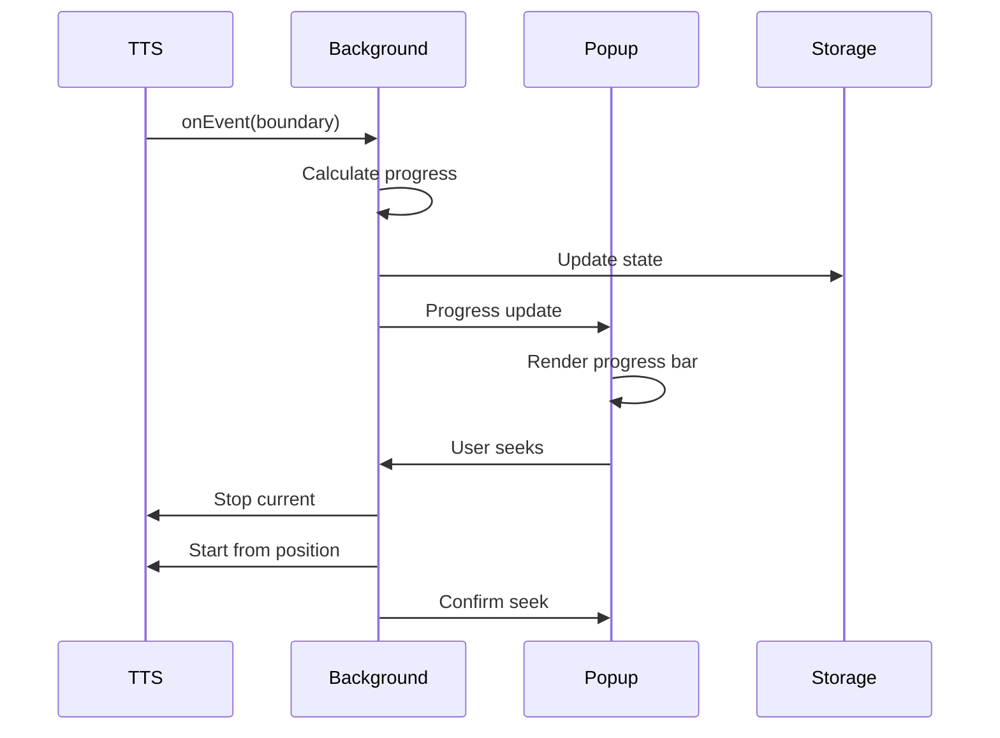

# Feature Specification: Progress Bar

**Feature ID**: FEATURE-PROGRESS-BAR  
**Version**: 1.0  
**Last Updated**: 2025-07-02  
**Status**: DRAFT  
**Priority**: HIGH  
**Estimated Effort**: 3-4 days  

## 1. Feature Overview

### 1.1 Description
The Progress Bar feature provides real-time visual feedback of TTS playback progress, displaying the current reading position, time elapsed, time remaining, and offering interactive seeking capabilities. This feature enhances user control by providing precise playback information and the ability to navigate to specific positions within the text.

### 1.2 Business Value
- **Enhanced User Control**: Users can see exactly where they are in the content and jump to specific positions
- **Time Management**: Clear indication of time remaining helps users plan their listening sessions
- **Better UX**: Visual progress feedback matches modern media player expectations
- **Reduced Anxiety**: Users know how much content remains without guessing
- **Improved Navigation**: Ability to replay sections or skip ahead as needed

### 1.3 Scope
- Visual progress bar in popup interface
- Real-time position tracking during playback
- Time elapsed and time remaining displays
- Interactive seeking by clicking on progress bar
- Progress persistence during pause states
- Integration with playback controls

## 2. User Stories

### 2.1 Primary User Stories

**US-001: Visual Progress During Playback**
```
As a user listening to TTS content,
I want to see a visual progress bar showing my current position,
So that I know how much content I've heard and how much remains.

Acceptance Criteria:
- Progress bar visible during active playback
- Bar fills from left to right as content is read
- Current position shown as percentage and time
- Smooth updates without flickering
- Clear visual distinction between played/unplayed portions
```

**US-002: Time Information Display**
```
As a user managing my time,
I want to see both elapsed and remaining time,
So that I can plan how long I'll be listening.

Acceptance Criteria:
- Elapsed time shown in MM:SS format
- Remaining time shown with minus sign (-MM:SS)
- Times update every second during playback
- Total duration shown when paused
- Accurate time calculations based on current speed
```

**US-003: Interactive Seeking**
```
As a user wanting to navigate content,
I want to click on the progress bar to jump to specific positions,
So that I can replay sections or skip ahead as needed.

Acceptance Criteria:
- Click anywhere on progress bar to seek
- Visual feedback during hover (tooltip with time)
- Smooth transition to new position
- Audio resumes from clicked position
- Seek works while playing or paused
```

### 2.2 Secondary User Stories

**US-004: Progress Persistence**
```
As a user who pauses frequently,
I want the progress bar to maintain position during pauses,
So that I always know where I am in the content.
```

**US-005: Multi-Speed Time Calculation**
```
As a user changing playback speed,
I want time remaining to update based on current speed,
So that I get accurate time estimates.
```

**US-006: Visual Feedback for Buffering**
```
As a user on slower connections,
I want to see when content is buffering or processing,
So that I understand any playback delays.
```

## 3. Technical Requirements

### 3.1 System Architecture

```typescript
// Core progress tracking interfaces
interface ProgressState {
  currentPosition: number;      // Current character index
  totalLength: number;         // Total text length
  elapsedTime: number;         // Milliseconds elapsed
  remainingTime: number;       // Milliseconds remaining
  percentComplete: number;     // 0-100
  isPlaying: boolean;
  isPaused: boolean;
  currentSpeed: number;        // Playback rate multiplier
}

interface ProgressUpdateEvent {
  charIndex: number;
  wordIndex: number;
  sentenceIndex: number;
  boundary: 'word' | 'sentence';
  timestamp: number;
}

// Service interface
interface IProgressBarService {
  startTracking(text: string, startPosition?: number): void;
  updateProgress(event: ProgressUpdateEvent): void;
  seek(position: number | percentage: number): Promise<void>;
  getState(): ProgressState;
  pauseTracking(): void;
  resumeTracking(): void;
  stopTracking(): void;
}
```

### 3.2 Chrome API Requirements
- **chrome.tts.speak()**: With onEvent callback for boundary events
- **chrome.runtime.onMessage**: For progress updates to popup
- **chrome.storage.local**: For persisting progress state
- **performance.now()**: For accurate time tracking

### 3.3 Component Integration

**Background Service Worker**
- Tracks character position during TTS events
- Calculates time elapsed and remaining
- Handles seek requests
- Broadcasts progress updates

**Content Script**
- Optional: Highlights current reading position
- Handles text measurements for accurate seeking
- Provides visual feedback in page

**Popup Interface**
- Renders progress bar component
- Displays time information
- Handles user interactions
- Updates in real-time

### 3.4 Data Flow



## 4. Implementation Details

### 4.1 Progress Tracking Service

```typescript
// src/background/services/progress-tracker.service.ts
export class ProgressTrackerService implements IProgressBarService {
  private state: ProgressState;
  private startTime: number;
  private pausedDuration: number = 0;
  private lastUpdateTime: number;
  private updateInterval: NodeJS.Timer | null = null;

  startTracking(text: string, startPosition: number = 0): void {
    this.state = {
      currentPosition: startPosition,
      totalLength: text.length,
      elapsedTime: 0,
      remainingTime: this.estimateTotalTime(text),
      percentComplete: (startPosition / text.length) * 100,
      isPlaying: true,
      isPaused: false,
      currentSpeed: 1.0
    };

    this.startTime = performance.now();
    this.lastUpdateTime = this.startTime;
    
    // Start real-time updates
    this.startUpdateTimer();
    
    // Listen for TTS events
    this.attachTTSListeners();
  }

  updateProgress(event: ProgressUpdateEvent): void {
    const now = performance.now();
    
    // Update position based on event
    this.state.currentPosition = event.charIndex;
    this.state.percentComplete = (event.charIndex / this.state.totalLength) * 100;
    
    // Calculate times
    const actualElapsed = now - this.startTime - this.pausedDuration;
    this.state.elapsedTime = actualElapsed;
    
    // Estimate remaining time based on progress rate
    const progressRate = event.charIndex / actualElapsed;
    const remainingChars = this.state.totalLength - event.charIndex;
    this.state.remainingTime = remainingChars / progressRate;
    
    // Broadcast update
    this.broadcastProgress();
    
    // Persist state
    this.persistState();
  }

  async seek(position: number): Promise<void> {
    // Validate position
    const targetPosition = this.normalizePosition(position);
    
    // Stop current playback
    await this.stopCurrentPlayback();
    
    // Update state
    this.state.currentPosition = targetPosition;
    this.state.percentComplete = (targetPosition / this.state.totalLength) * 100;
    
    // Recalculate times
    this.recalculateTimes(targetPosition);
    
    // Resume from new position
    await this.resumeFromPosition(targetPosition);
    
    // Broadcast update
    this.broadcastProgress();
  }

  private estimateTotalTime(text: string): number {
    // Estimate based on average reading speed
    const wordsPerMinute = 150 / this.state.currentSpeed;
    const wordCount = text.split(/\s+/).length;
    return (wordCount / wordsPerMinute) * 60 * 1000; // milliseconds
  }

  private startUpdateTimer(): void {
    this.updateInterval = setInterval(() => {
      if (this.state.isPlaying && !this.state.isPaused) {
        // Increment elapsed time
        const now = performance.now();
        const delta = now - this.lastUpdateTime;
        this.state.elapsedTime += delta;
        this.lastUpdateTime = now;
        
        // Update remaining time
        const progress = this.state.percentComplete / 100;
        const estimatedTotal = this.state.elapsedTime / progress;
        this.state.remainingTime = estimatedTotal - this.state.elapsedTime;
        
        // Broadcast time update
        this.broadcastProgress();
      }
    }, 1000); // Update every second
  }

  private broadcastProgress(): void {
    chrome.runtime.sendMessage({
      type: 'PROGRESS_UPDATE',
      data: this.state
    }).catch(() => {
      // Popup might be closed
    });
  }
}
```

### 4.2 Progress Bar UI Component

```tsx
// src/popup/components/ProgressBar.tsx
import React, { useState, useEffect, useRef } from 'react';

interface ProgressBarProps {
  onSeek: (position: number) => void;
}

export const ProgressBar: React.FC<ProgressBarProps> = ({ onSeek }) => {
  const [progress, setProgress] = useState<ProgressState | null>(null);
  const [hoverPosition, setHoverPosition] = useState<number | null>(null);
  const progressBarRef = useRef<HTMLDivElement>(null);

  useEffect(() => {
    // Listen for progress updates
    const handleMessage = (message: any) => {
      if (message.type === 'PROGRESS_UPDATE') {
        setProgress(message.data);
      }
    };

    chrome.runtime.onMessage.addListener(handleMessage);
    
    // Request current state
    chrome.runtime.sendMessage({ type: 'GET_PROGRESS_STATE' });

    return () => {
      chrome.runtime.onMessage.removeListener(handleMessage);
    };
  }, []);

  const handleClick = (event: React.MouseEvent) => {
    if (!progressBarRef.current || !progress) return;

    const rect = progressBarRef.current.getBoundingClientRect();
    const x = event.clientX - rect.left;
    const percentage = (x / rect.width) * 100;
    const position = (percentage / 100) * progress.totalLength;

    onSeek(position);
  };

  const handleMouseMove = (event: React.MouseEvent) => {
    if (!progressBarRef.current || !progress) return;

    const rect = progressBarRef.current.getBoundingClientRect();
    const x = event.clientX - rect.left;
    const percentage = (x / rect.width) * 100;
    
    setHoverPosition(percentage);
  };

  const formatTime = (ms: number): string => {
    const seconds = Math.floor(ms / 1000);
    const minutes = Math.floor(seconds / 60);
    const remainingSeconds = seconds % 60;
    return `${minutes}:${remainingSeconds.toString().padStart(2, '0')}`;
  };

  if (!progress) {
    return null;
  }

  return (
    <div className="progress-container">
      {/* Time displays */}
      <div className="flex justify-between text-xs text-gray-600 mb-1">
        <span>{formatTime(progress.elapsedTime)}</span>
        <span>-{formatTime(progress.remainingTime)}</span>
      </div>

      {/* Progress bar */}
      <div
        ref={progressBarRef}
        className="progress-bar-wrapper relative h-2 bg-gray-200 rounded-full cursor-pointer overflow-hidden"
        onClick={handleClick}
        onMouseMove={handleMouseMove}
        onMouseLeave={() => setHoverPosition(null)}
      >
        {/* Progress fill */}
        <div
          className="progress-fill bg-primary h-full transition-all duration-300 ease-out"
          style={{ width: `${progress.percentComplete}%` }}
        />

        {/* Hover indicator */}
        {hoverPosition !== null && (
          <>
            <div
              className="absolute top-0 h-full w-0.5 bg-gray-400"
              style={{ left: `${hoverPosition}%` }}
            />
            <div
              className="absolute -top-8 transform -translate-x-1/2 bg-gray-800 text-white px-2 py-1 rounded text-xs"
              style={{ left: `${hoverPosition}%` }}
            >
              {formatTime((hoverPosition / 100) * (progress.elapsedTime + progress.remainingTime))}
            </div>
          </>
        )}

        {/* Buffering indicator */}
        {progress.isBuffering && (
          <div className="absolute inset-0 flex items-center justify-center">
            <div className="animate-pulse text-xs text-gray-600">Buffering...</div>
          </div>
        )}
      </div>

      {/* Additional info */}
      <div className="flex justify-between text-xs text-gray-500 mt-1">
        <span>{Math.round(progress.percentComplete)}%</span>
        <span>{progress.currentSpeed}x speed</span>
      </div>
    </div>
  );
};
```

### 4.3 Seek Implementation

```typescript
// src/background/services/seek-handler.ts
export class SeekHandler {
  private synthesizer: SpeechSynthesizer;
  private currentText: string;
  private currentVoice: string;

  async seekToPosition(charIndex: number): Promise<void> {
    // Validate position
    if (charIndex < 0 || charIndex > this.currentText.length) {
      throw new Error('Invalid seek position');
    }

    // Stop current playback
    await this.synthesizer.stop();

    // Extract text from seek position
    const remainingText = this.currentText.substring(charIndex);

    // Find sentence boundary for natural start
    const sentenceStart = this.findSentenceBoundary(this.currentText, charIndex);
    const textToRead = this.currentText.substring(sentenceStart);

    // Calculate offset within first sentence
    const offset = charIndex - sentenceStart;

    // Resume playback
    await this.synthesizer.speak(textToRead, {
      voice: this.currentVoice,
      rate: this.currentSpeed,
      startOffset: offset,
      onBoundary: (event) => {
        // Adjust char indices based on original position
        this.handleBoundaryEvent({
          ...event,
          charIndex: event.charIndex + sentenceStart
        });
      }
    });
  }

  private findSentenceBoundary(text: string, position: number): number {
    // Search backwards for sentence start
    const sentenceEnders = /[.!?]\s+/g;
    let lastBoundary = 0;
    let match;

    while ((match = sentenceEnders.exec(text)) !== null) {
      if (match.index + match[0].length >= position) {
        break;
      }
      lastBoundary = match.index + match[0].length;
    }

    return lastBoundary;
  }
}
```

## 5. Acceptance Criteria

### 5.1 Functional Criteria

**AC-001: Progress Bar Display**
- [ ] Progress bar visible in popup during playback
- [ ] Bar width accurately represents completion percentage
- [ ] Smooth animation without jumps or flickers
- [ ] Different colors for played vs unplayed portions
- [ ] Responsive to popup width changes

**AC-002: Time Display Accuracy**
- [ ] Elapsed time updates every second
- [ ] Remaining time calculated based on current speed
- [ ] Format: MM:SS for times under 1 hour
- [ ] Format: H:MM:SS for times over 1 hour
- [ ] Negative sign for remaining time

**AC-003: Interactive Seeking**
- [ ] Click anywhere on bar to seek
- [ ] Hover shows time tooltip
- [ ] Seek works during playback
- [ ] Seek works when paused
- [ ] Audio resumes from correct position

**AC-004: Progress Persistence**
- [ ] Progress maintained during pause
- [ ] Progress survives popup close/open
- [ ] Progress cleared on stop
- [ ] Progress accurate after speed changes
- [ ] Progress syncs across multiple popups

**AC-005: Performance Requirements**
- [ ] Updates consume < 1% CPU
- [ ] No memory leaks over extended playback
- [ ] Smooth 60fps animations
- [ ] < 50ms seek response time
- [ ] Accurate to within 1 second

### 5.2 Edge Cases

**AC-006: Boundary Conditions**
- [ ] Handle seek to position 0
- [ ] Handle seek to final position
- [ ] Handle very short texts (< 10 chars)
- [ ] Handle very long texts (> 50k chars)
- [ ] Handle rapid seek requests

**AC-007: Speed Change Handling**
- [ ] Time remaining updates on speed change
- [ ] Progress percentage unaffected by speed
- [ ] Smooth transition in time displays
- [ ] Accurate calculations at all speeds (0.5x-3x)

## 6. Test Cases

### 6.1 Unit Tests

```typescript
// tests/unit/progress-tracker.test.ts
describe('ProgressTrackerService', () => {
  let service: ProgressTrackerService;

  beforeEach(() => {
    service = new ProgressTrackerService();
  });

  describe('startTracking', () => {
    it('should initialize state correctly', () => {
      const text = 'Hello world, this is a test.';
      service.startTracking(text);

      const state = service.getState();
      expect(state.currentPosition).toBe(0);
      expect(state.totalLength).toBe(text.length);
      expect(state.percentComplete).toBe(0);
      expect(state.isPlaying).toBe(true);
    });

    it('should handle start position', () => {
      const text = 'Hello world, this is a test.';
      service.startTracking(text, 12); // Start at "this"

      const state = service.getState();
      expect(state.currentPosition).toBe(12);
      expect(state.percentComplete).toBeCloseTo(42.86, 1);
    });
  });

  describe('updateProgress', () => {
    it('should update position accurately', () => {
      const text = 'The quick brown fox jumps.';
      service.startTracking(text);

      service.updateProgress({
        charIndex: 10,
        wordIndex: 2,
        sentenceIndex: 0,
        boundary: 'word',
        timestamp: 1000
      });

      const state = service.getState();
      expect(state.currentPosition).toBe(10);
      expect(state.percentComplete).toBeCloseTo(38.46, 1);
    });

    it('should calculate remaining time', () => {
      const text = 'A'.repeat(1000); // 1000 chars
      service.startTracking(text);

      // Simulate progress after 5 seconds at 200 chars
      jest.advanceTimersByTime(5000);
      service.updateProgress({
        charIndex: 200,
        wordIndex: 40,
        sentenceIndex: 2,
        boundary: 'word',
        timestamp: 5000
      });

      const state = service.getState();
      expect(state.elapsedTime).toBeCloseTo(5000, -2);
      expect(state.remainingTime).toBeCloseTo(20000, -2); // 20 seconds remaining
    });
  });

  describe('seek', () => {
    it('should seek to absolute position', async () => {
      const text = 'First sentence. Second sentence. Third sentence.';
      service.startTracking(text);

      await service.seek(16); // Start of second sentence

      const state = service.getState();
      expect(state.currentPosition).toBe(16);
      expect(state.percentComplete).toBeCloseTo(33.33, 1);
    });

    it('should seek to percentage', async () => {
      const text = 'Test content for seeking';
      service.startTracking(text);

      await service.seek(0.5); // 50%

      const state = service.getState();
      expect(state.currentPosition).toBe(12);
      expect(state.percentComplete).toBe(50);
    });

    it('should handle invalid positions', async () => {
      const text = 'Test text';
      service.startTracking(text);

      await expect(service.seek(-10)).rejects.toThrow('Invalid seek position');
      await expect(service.seek(1000)).rejects.toThrow('Invalid seek position');
    });
  });
});
```

### 6.2 Integration Tests

```typescript
// tests/integration/progress-bar-integration.test.ts
describe('Progress Bar Integration', () => {
  let extension: ChromeExtension;

  beforeEach(async () => {
    extension = await loadExtension();
  });

  it('should show progress during playback', async () => {
    const text = 'This is a longer text that will take several seconds to read completely.';
    
    // Start reading
    await extension.startReading(text);
    
    // Open popup and check progress bar
    await extension.popup.open();
    
    // Initial state
    const progress = await extension.popup.getProgress();
    expect(progress.percentComplete).toBe(0);
    
    // Wait for progress
    await extension.waitForProgress(25);
    
    // Check updated progress
    const updatedProgress = await extension.popup.getProgress();
    expect(updatedProgress.percentComplete).toBeGreaterThan(20);
    expect(updatedProgress.percentComplete).toBeLessThan(30);
    expect(updatedProgress.elapsedTime).toBeGreaterThan(0);
    expect(updatedProgress.remainingTime).toBeGreaterThan(0);
  });

  it('should handle seeking during playback', async () => {
    const text = 'First part of content. Second part of content. Third part of content.';
    
    await extension.startReading(text);
    await extension.popup.open();
    
    // Seek to 50%
    await extension.popup.seekToPercent(50);
    
    // Verify position updated
    const progress = await extension.popup.getProgress();
    expect(progress.percentComplete).toBeCloseTo(50, 1);
    
    // Verify audio continues from new position
    const isPlaying = await extension.isPlaying();
    expect(isPlaying).toBe(true);
  });

  it('should update times based on speed', async () => {
    const text = 'Test content for speed-adjusted time calculations.';
    
    await extension.startReading(text);
    await extension.popup.open();
    
    // Get initial remaining time at 1x speed
    await extension.waitForProgress(10);
    const normalSpeed = await extension.popup.getProgress();
    const normalRemaining = normalSpeed.remainingTime;
    
    // Change to 2x speed
    await extension.popup.setSpeed(2.0);
    await extension.waitForProgress(1);
    
    // Remaining time should be roughly half
    const fastSpeed = await extension.popup.getProgress();
    expect(fastSpeed.remainingTime).toBeCloseTo(normalRemaining / 2, -2);
  });
});
```

### 6.3 E2E Test Scenarios

**E2E-001: Complete Progress Flow**
1. Navigate to article with long content
2. Select all text (Ctrl+A)
3. Start TTS from context menu
4. Open popup immediately
5. Verify progress bar appears and starts at 0%
6. Wait 10 seconds
7. Verify progress has advanced
8. Click at 75% mark on progress bar
9. Verify seek to 75% position
10. Let playback complete
11. Verify 100% completion

**E2E-002: Multi-Speed Progress**
1. Start reading medium-length content
2. Note initial time remaining
3. Change speed to 2x
4. Verify time remaining is halved
5. Change speed to 0.5x
6. Verify time remaining is quadrupled
7. Progress percentage remains unaffected

**E2E-003: Pause and Resume Progress**
1. Start reading content
2. Let progress reach 30%
3. Pause playback
4. Note exact position and times
5. Close popup
6. Wait 10 seconds
7. Open popup
8. Verify progress shows same 30%
9. Resume playback
10. Verify continues from correct position

## 7. UI/UX Specifications

### 7.1 Visual Design

**Progress Bar Styling**
```css
/* Progress bar container */
.progress-container {
  width: 100%;
  padding: 8px 0;
}

/* Time displays */
.time-display {
  font-size: 12px;
  color: #6B7280; /* Gray-500 */
  font-variant-numeric: tabular-nums; /* Monospace numbers */
}

/* Progress bar track */
.progress-bar-wrapper {
  height: 8px;
  background: #E5E7EB; /* Gray-200 */
  border-radius: 4px;
  position: relative;
  cursor: pointer;
  overflow: hidden;
}

/* Progress fill */
.progress-fill {
  height: 100%;
  background: linear-gradient(90deg, #3B82F6 0%, #2563EB 100%);
  transition: width 0.3s ease-out;
  position: relative;
}

/* Animated shimmer effect */
.progress-fill::after {
  content: '';
  position: absolute;
  top: 0;
  left: 0;
  right: 0;
  bottom: 0;
  background: linear-gradient(
    90deg,
    transparent,
    rgba(255, 255, 255, 0.2),
    transparent
  );
  animation: shimmer 2s infinite;
}

/* Hover state */
.progress-bar-wrapper:hover {
  transform: scaleY(1.25);
  transition: transform 0.1s ease;
}

/* Seek indicator */
.seek-indicator {
  position: absolute;
  width: 2px;
  height: 100%;
  background: #9CA3AF; /* Gray-400 */
  pointer-events: none;
}

/* Time tooltip */
.time-tooltip {
  position: absolute;
  bottom: 16px;
  transform: translateX(-50%);
  background: #1F2937; /* Gray-800 */
  color: white;
  padding: 4px 8px;
  border-radius: 4px;
  font-size: 11px;
  white-space: nowrap;
  pointer-events: none;
}

/* Buffering state */
.progress-buffering {
  background: repeating-linear-gradient(
    -45deg,
    #E5E7EB,
    #E5E7EB 10px,
    #D1D5DB 10px,
    #D1D5DB 20px
  );
  animation: buffer-scroll 1s linear infinite;
}

@keyframes shimmer {
  0% { transform: translateX(-100%); }
  100% { transform: translateX(100%); }
}

@keyframes buffer-scroll {
  0% { background-position: 0 0; }
  100% { background-position: 28px 0; }
}
```

### 7.2 Layout Specifications

**Progress Bar Component Layout**
```
┌─────────────────────────────────────┐
│ 0:45                         -2:15  │  <- Time displays
├─────────────────────────────────────┤
│ ████████░░░░░░░░░░░░░░░░░░░░░░░░░ │  <- Progress bar
├─────────────────────────────────────┤
│ 25%                          1.5x   │  <- Info displays
└─────────────────────────────────────┘
```

**Dimensions**
- Container width: 100% of popup (min 280px)
- Bar height: 8px (10px on hover)
- Vertical spacing: 4px between elements
- Font sizes: 12px for times, 11px for info
- Touch target: 44px height for mobile

### 7.3 Interactive Behavior

**Hover Effects**
- Progress bar scales vertically by 25%
- Cursor changes to pointer
- Time tooltip appears at mouse position
- Seek line preview shows at hover position

**Click/Tap Behavior**
- Immediate visual feedback (ripple effect)
- Progress jumps to clicked position
- Smooth transition animation (300ms)
- Audio briefly pauses during seek

**Responsive Design**
- Mobile: Larger touch targets (12px bar height)
- Tablet: Standard sizing
- Desktop: Hover effects enabled
- Accessibility: Keyboard navigation support

## 8. Error Handling

### 8.1 Error Scenarios

**ERR-001: Progress Update Failures**
```typescript
try {
  chrome.runtime.sendMessage({ type: 'PROGRESS_UPDATE', data });
} catch (error) {
  // Popup might be closed or extension context invalid
  console.debug('Progress update failed - popup likely closed');
  // Continue tracking internally
}
```

**ERR-002: Seek Position Invalid**
```typescript
seekToPosition(position: number): void {
  // Clamp to valid range
  const clampedPosition = Math.max(0, Math.min(position, this.totalLength));
  
  if (position !== clampedPosition) {
    console.warn(`Seek position ${position} clamped to ${clampedPosition}`);
  }
  
  // Proceed with clamped position
  this.performSeek(clampedPosition);
}
```

**ERR-003: Time Calculation Errors**
```typescript
calculateRemainingTime(): number {
  try {
    const rate = this.currentPosition / this.elapsedTime;
    if (rate <= 0 || !isFinite(rate)) {
      // Fallback to estimate
      return this.estimateRemainingTime();
    }
    return (this.totalLength - this.currentPosition) / rate;
  } catch (error) {
    console.error('Time calculation failed:', error);
    return 0; // Show --:-- in UI
  }
}
```

### 8.2 User-Facing Error Messages

| Error Code | User Message | Recovery Action |
|------------|--------------|-----------------|
| E001 | "Progress tracking temporarily unavailable" | Hide progress bar |
| E002 | "Unable to seek to this position" | Show nearest valid position |
| E003 | "Time calculation in progress..." | Show placeholder times |
| E004 | "Seek failed - please try again" | Retry button |

### 8.3 Fallback Behaviors

**No Progress Events**
- Show indeterminate progress bar
- Display elapsed time only
- Disable seeking functionality
- Log issue for debugging

**Inaccurate Positions**
- Smooth interpolation between updates
- Validate against reasonable bounds
- Use predictive positioning
- Correct on next accurate update

## 9. Dependencies

### 9.1 External Dependencies
- **Chrome TTS API**: Boundary events for position tracking
- **Performance API**: High-resolution timing
- **React**: UI component framework
- **DaisyUI/Tailwind**: Styling framework

### 9.2 Internal Dependencies
- **SpeechSynthesizer**: Provides TTS events and control
- **StateManager**: Maintains playback state
- **MessageHandler**: Communication between components
- **StorageService**: Progress persistence

### 9.3 Feature Dependencies
- **Feature-2.1**: Basic TTS (required for events)
- **Feature-2.2**: Playback Controls (integration)
- **Feature-Pause-Resume**: State coordination

## 10. Performance Considerations

### 10.1 Optimization Strategies

**Update Frequency**
- Throttle progress updates to 10Hz max
- Batch multiple updates within 100ms
- Use requestAnimationFrame for animations
- Debounce hover position updates

**Memory Management**
- Limit event history to last 100 events
- Clear old progress states after completion
- Use weak references for event handlers
- Implement circular buffer for positions

**CPU Usage**
- Suspend updates when popup closed
- Use CSS transitions instead of JS
- Optimize time calculations
- Cache frequently accessed values

### 10.2 Performance Targets

| Metric | Target | Maximum |
|--------|--------|---------|
| Update latency | < 16ms | 33ms |
| CPU usage | < 1% | 2% |
| Memory footprint | < 1MB | 2MB |
| Animation FPS | 60 | 30 |
| Seek response | < 50ms | 100ms |

## 11. Accessibility

### 11.1 Screen Reader Support

**ARIA Attributes**
```html
<div role="progressbar"
     aria-valuenow="25"
     aria-valuemin="0"
     aria-valuemax="100"
     aria-label="Reading progress: 25% complete">
  <div class="progress-fill" style="width: 25%"></div>
</div>

<div aria-live="polite" aria-atomic="true">
  <span class="sr-only">1 minute 15 seconds elapsed, 3 minutes 45 seconds remaining</span>
</div>
```

### 11.2 Keyboard Navigation

**Keyboard Controls**
- `Tab`: Focus progress bar
- `Arrow Left/Right`: Seek backward/forward 5%
- `Home/End`: Jump to start/end
- `Space`: Play/pause
- `Shift+Arrow`: Fine seek (1%)

### 11.3 Visual Accessibility

**High Contrast Mode**
- Ensure 4.5:1 contrast ratio
- Distinct colors for progress states
- Clear focus indicators
- No color-only information

**Reduced Motion**
- Respect prefers-reduced-motion
- Disable animations when set
- Instant position updates
- No decorative animations

## 12. Future Enhancements

### 12.1 Advanced Features
- Chapter markers and navigation
- Visual waveform representation
- Speed-adjusted progress preview
- Multiple progress tracks (sentences/paragraphs)
- Bookmark positions for later

### 12.2 Integration Opportunities
- Sync progress across devices
- Export progress reports
- Integration with reading apps
- Progress analytics and insights

## 13. Success Metrics

### 13.1 User Engagement
- Progress bar interaction rate > 40%
- Seek feature usage > 25% of sessions
- Average seeks per session: 2-5
- Feature satisfaction > 4.5/5

### 13.2 Technical Metrics
- Position accuracy > 98%
- Time calculation accuracy > 95%
- Seek success rate > 99.9%
- No performance degradation

### 13.3 User Feedback Goals
- "Progress tracking is accurate" > 90%
- "Seeking works smoothly" > 95%
- "Time estimates are helpful" > 85%
- Bug reports < 0.1% of users

---

**Document Version History**
- v1.0 (2025-07-02): Initial specification created
- [Future versions will be listed here]

**Approvals Required**
- [ ] Engineering Lead
- [ ] Product Manager  
- [ ] UX Designer
- [ ] QA Lead