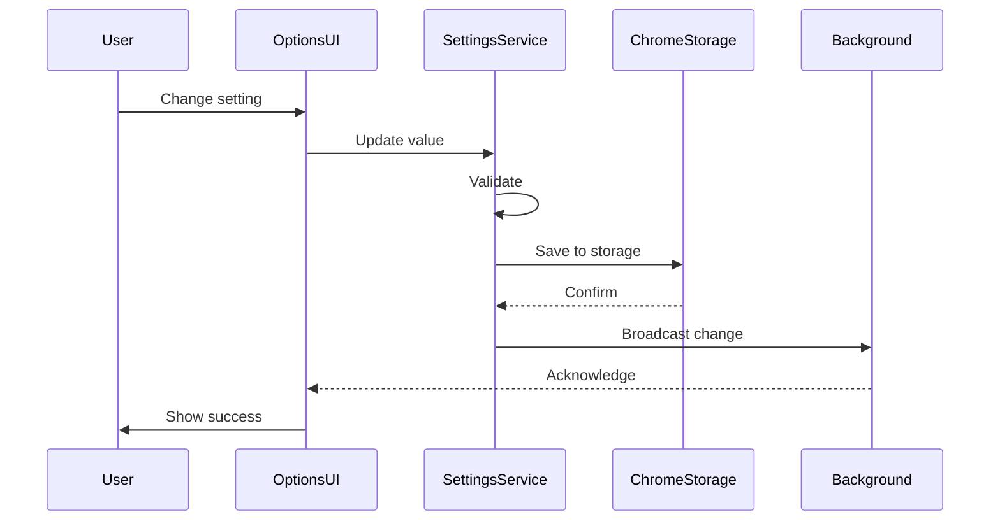

# Feature Specification: Settings Page

**Feature ID**: FEATURE-SETTINGS-PAGE  
**Version**: 1.0  
**Last Updated**: 2025-07-02  
**Status**: DRAFT  
**Priority**: HIGH  
**Estimated Effort**: 5-7 days  

## 1. Feature Overview

### 1.1 Description
The Settings Page provides a comprehensive configuration interface for the TTS Chrome Extension, allowing users to customize their text-to-speech experience with preferences for voices, keyboard shortcuts, visual themes, playback defaults, and advanced features. The page includes robust import/export functionality for settings backup and sharing.

### 1.2 Business Value
- **Personalization**: Users can tailor the extension to their specific needs and preferences
- **Accessibility**: Customizable keyboard shortcuts and themes improve accessibility for diverse users
- **User Retention**: Advanced customization options increase user satisfaction and long-term engagement
- **Support Reduction**: Self-service configuration reduces support requests
- **Cross-Device Sync**: Import/export enables settings portability across devices

### 1.3 Scope
- Full-featured settings/options page accessible via extension icon and chrome://extensions
- Voice preferences with per-domain overrides
- Keyboard shortcut customization with conflict detection
- Visual theme selection (Light/Dark/System)
- Playback defaults (speed, volume, pitch)
- Import/Export functionality for all settings
- Settings validation and error handling
- Real-time preview of changes

## 2. User Stories

### 2.1 Primary User Stories

**US-001: Access and Navigate Settings**
```
As a user of the TTS extension,
I want to easily access the settings page from multiple entry points,
So that I can quickly configure my preferences without disrupting my workflow.

Acceptance Criteria:
- Settings accessible via extension popup gear icon
- Settings accessible via right-click on extension icon
- Settings accessible via chrome://extensions options link
- Clean, organized layout with logical sections
- Responsive design that works on all screen sizes
```

**US-002: Configure Voice Preferences**
```
As a user who reads content in multiple languages,
I want to set default voices and create domain-specific voice rules,
So that different websites automatically use appropriate voices.

Acceptance Criteria:
- Select default voice from all available system voices
- Create domain-specific voice overrides
- Test voices with sample text before saving
- See voice metadata (language, gender, quality)
- Set fallback voice if primary unavailable
```

**US-003: Customize Keyboard Shortcuts**
```
As a power user,
I want to customize all keyboard shortcuts for TTS controls,
So that I can use shortcuts that don't conflict with other tools.

Acceptance Criteria:
- View all available TTS commands
- Set custom keyboard combinations
- Real-time conflict detection
- Reset to defaults option
- Disable individual shortcuts if needed
```

**US-004: Select Visual Theme**
```
As a user who works in different lighting conditions,
I want to choose between light, dark, and system-matched themes,
So that the extension UI is comfortable to use at all times.

Acceptance Criteria:
- Light theme with appropriate contrast
- Dark theme with reduced eye strain
- System theme that follows OS preference
- Instant preview of theme changes
- Theme applies to popup, options, and notifications
```

**US-005: Import/Export Settings**
```
As a user with multiple devices,
I want to export my settings and import them on other machines,
So that I have a consistent experience across all my devices.

Acceptance Criteria:
- Export all settings to JSON file
- Import settings from JSON file
- Validate imported settings
- Merge or replace options
- Success/error notifications
```

### 2.2 Secondary User Stories

**US-006: Configure Playback Defaults**
```
As a user with specific reading preferences,
I want to set default speed, volume, and pitch values,
So that all TTS playback starts with my preferred settings.
```

**US-007: Manage Advanced Features**
```
As an advanced user,
I want to enable/disable features like auto-highlight and text cleanup,
So that I can optimize the extension for my use cases.
```

**US-008: Reset Settings**
```
As a user who has misconfigured settings,
I want to reset all or specific settings to defaults,
So that I can start fresh without reinstalling.
```

## 3. Technical Requirements

### 3.1 System Architecture

```typescript
// Core settings structure
interface ExtensionSettings {
  version: string;
  voice: VoiceSettings;
  shortcuts: ShortcutSettings;
  theme: ThemeSettings;
  playback: PlaybackSettings;
  advanced: AdvancedSettings;
  domains: DomainOverrides;
}

interface VoiceSettings {
  defaultVoice: string;
  fallbackVoice: string;
  favoriteVoices: string[];
  voiceMetadata: Map<string, VoiceInfo>;
}

interface ShortcutSettings {
  commands: {
    [key: string]: {
      shortcut: string;
      enabled: boolean;
      description: string;
    };
  };
}

interface ThemeSettings {
  mode: 'light' | 'dark' | 'system';
  customColors?: ColorPalette;
}

interface PlaybackSettings {
  defaultSpeed: number;
  defaultVolume: number;
  defaultPitch: number;
  autoPlay: boolean;
  pauseOnTabSwitch: boolean;
}

// Settings service interface
interface ISettingsService {
  getAll(): Promise<ExtensionSettings>;
  get<K extends keyof ExtensionSettings>(key: K): Promise<ExtensionSettings[K]>;
  set<K extends keyof ExtensionSettings>(key: K, value: ExtensionSettings[K]): Promise<void>;
  reset(key?: keyof ExtensionSettings): Promise<void>;
  export(): Promise<string>;
  import(data: string, mode: 'merge' | 'replace'): Promise<void>;
  validate(settings: Partial<ExtensionSettings>): ValidationResult;
}
```

### 3.2 Chrome API Requirements
- **chrome.storage.sync**: Sync settings across devices (with size limits)
- **chrome.storage.local**: Store large data like voice metadata
- **chrome.commands**: Register and update keyboard shortcuts
- **chrome.tts.getVoices()**: Enumerate available voices
- **chrome.runtime**: Handle settings page lifecycle
- **chrome.tabs**: Preview settings on active tab

### 3.3 Component Architecture

**Options Page Structure**
```
src/options/
├── index.ts           # Entry point and initialization
├── options.html       # Main HTML structure
├── options.css        # Global styles (Tailwind + DaisyUI)
├── components/
│   ├── SettingsLayout.ts
│   ├── VoiceSettings.ts
│   ├── ShortcutSettings.ts
│   ├── ThemeSettings.ts
│   ├── PlaybackSettings.ts
│   ├── AdvancedSettings.ts
│   └── ImportExport.ts
├── services/
│   ├── settings.service.ts
│   ├── validation.service.ts
│   └── sync.service.ts
└── utils/
    ├── theme.utils.ts
    └── shortcut.utils.ts
```

### 3.4 Data Flow



## 4. Implementation Details

### 4.1 Settings Service Implementation

```typescript
// src/options/services/settings.service.ts
export class SettingsService implements ISettingsService {
  private cache: ExtensionSettings | null = null;
  private listeners: Map<string, Set<Function>> = new Map();
  
  async initialize(): Promise<void> {
    // Load settings from storage
    await this.loadSettings();
    
    // Set up storage change listener
    chrome.storage.onChanged.addListener(this.handleStorageChange);
    
    // Validate and migrate if needed
    await this.migrateSettings();
  }

  async getAll(): Promise<ExtensionSettings> {
    if (!this.cache) {
      await this.loadSettings();
    }
    return { ...this.cache! };
  }

  async get<K extends keyof ExtensionSettings>(
    key: K
  ): Promise<ExtensionSettings[K]> {
    const settings = await this.getAll();
    return settings[key];
  }

  async set<K extends keyof ExtensionSettings>(
    key: K, 
    value: ExtensionSettings[K]
  ): Promise<void> {
    // Validate the new value
    const validation = await this.validate({ [key]: value });
    if (!validation.valid) {
      throw new Error(`Invalid ${key}: ${validation.errors.join(', ')}`);
    }

    // Update cache
    if (this.cache) {
      this.cache[key] = value;
    }

    // Determine storage type based on data size
    const storage = this.shouldUseSyncStorage(key) 
      ? chrome.storage.sync 
      : chrome.storage.local;

    // Save to storage
    await storage.set({ [key]: value });

    // Notify listeners
    this.notifyListeners(key, value);

    // Broadcast to other components
    await this.broadcastChange(key, value);
  }

  async export(): Promise<string> {
    const settings = await this.getAll();
    const exportData = {
      version: chrome.runtime.getManifest().version,
      timestamp: new Date().toISOString(),
      settings
    };
    
    return JSON.stringify(exportData, null, 2);
  }

  async import(data: string, mode: 'merge' | 'replace'): Promise<void> {
    try {
      const parsed = JSON.parse(data);
      
      // Validate import data structure
      if (!parsed.settings || !parsed.version) {
        throw new Error('Invalid import file format');
      }

      // Validate settings
      const validation = await this.validate(parsed.settings);
      if (!validation.valid) {
        throw new Error(`Invalid settings: ${validation.errors.join(', ')}`);
      }

      if (mode === 'replace') {
        // Clear existing settings
        await this.reset();
      }

      // Import settings
      for (const [key, value] of Object.entries(parsed.settings)) {
        if (mode === 'merge' && key === 'domains') {
          // Special handling for domain overrides - merge instead of replace
          const existing = await this.get('domains');
          await this.set('domains', { ...existing, ...value });
        } else {
          await this.set(key as keyof ExtensionSettings, value);
        }
      }

      // Reload extension to apply all changes
      chrome.runtime.reload();
    } catch (error) {
      console.error('Import failed:', error);
      throw new Error('Failed to import settings: ' + error.message);
    }
  }

  async validate(settings: Partial<ExtensionSettings>): Promise<ValidationResult> {
    const errors: string[] = [];

    // Voice validation
    if (settings.voice) {
      if (settings.voice.defaultVoice) {
        const voices = await chrome.tts.getVoices();
        const voiceExists = voices.some(v => v.voiceName === settings.voice!.defaultVoice);
        if (!voiceExists) {
          errors.push('Default voice not available on this system');
        }
      }
    }

    // Shortcut validation
    if (settings.shortcuts) {
      for (const [command, config] of Object.entries(settings.shortcuts.commands)) {
        if (config.shortcut && !this.isValidShortcut(config.shortcut)) {
          errors.push(`Invalid shortcut for ${command}: ${config.shortcut}`);
        }
      }
    }

    // Playback validation
    if (settings.playback) {
      const { defaultSpeed, defaultVolume, defaultPitch } = settings.playback;
      if (defaultSpeed && (defaultSpeed < 0.1 || defaultSpeed > 10)) {
        errors.push('Speed must be between 0.1 and 10');
      }
      if (defaultVolume && (defaultVolume < 0 || defaultVolume > 1)) {
        errors.push('Volume must be between 0 and 1');
      }
      if (defaultPitch && (defaultPitch < 0 || defaultPitch > 2)) {
        errors.push('Pitch must be between 0 and 2');
      }
    }

    return {
      valid: errors.length === 0,
      errors
    };
  }

  private async broadcastChange<K extends keyof ExtensionSettings>(
    key: K,
    value: ExtensionSettings[K]
  ): Promise<void> {
    // Notify background script
    await chrome.runtime.sendMessage({
      type: 'SETTINGS_CHANGED',
      key,
      value
    });

    // Notify all tabs
    const tabs = await chrome.tabs.query({});
    for (const tab of tabs) {
      if (tab.id) {
        chrome.tabs.sendMessage(tab.id, {
          type: 'SETTINGS_CHANGED',
          key,
          value
        }).catch(() => {
          // Tab might not have content script
        });
      }
    }
  }
}
```

### 4.2 Voice Settings Component

```typescript
// src/options/components/VoiceSettings.ts
export class VoiceSettingsComponent {
  private container: HTMLElement;
  private settingsService: SettingsService;
  private voices: chrome.tts.TtsVoice[] = [];
  
  constructor(container: HTMLElement, settingsService: SettingsService) {
    this.container = container;
    this.settingsService = settingsService;
    this.initialize();
  }

  private async initialize(): Promise<void> {
    // Load available voices
    this.voices = await chrome.tts.getVoices();
    
    // Render the component
    await this.render();
    
    // Set up event listeners
    this.attachEventListeners();
  }

  private async render(): Promise<void> {
    const settings = await this.settingsService.get('voice');
    
    this.container.innerHTML = `
      <div class="voice-settings">
        <h2 class="text-2xl font-bold mb-4">Voice Settings</h2>
        
        <!-- Default Voice Selection -->
        <div class="form-control mb-6">
          <label class="label">
            <span class="label-text">Default Voice</span>
            <span class="label-text-alt">Used for all text-to-speech</span>
          </label>
          <div class="flex gap-2">
            <select id="defaultVoice" class="select select-bordered flex-1">
              <option value="">System Default</option>
              ${this.renderVoiceOptions(settings.defaultVoice)}
            </select>
            <button id="testDefaultVoice" class="btn btn-secondary">
              Test
            </button>
          </div>
        </div>

        <!-- Fallback Voice -->
        <div class="form-control mb-6">
          <label class="label">
            <span class="label-text">Fallback Voice</span>
            <span class="label-text-alt">Used if default is unavailable</span>
          </label>
          <select id="fallbackVoice" class="select select-bordered">
            <option value="">None</option>
            ${this.renderVoiceOptions(settings.fallbackVoice)}
          </select>
        </div>

        <!-- Favorite Voices -->
        <div class="form-control mb-6">
          <label class="label">
            <span class="label-text">Favorite Voices</span>
            <span class="label-text-alt">Quick access in popup menu</span>
          </label>
          <div id="favoriteVoices" class="space-y-2">
            ${this.renderFavoriteVoices(settings.favoriteVoices)}
          </div>
          <button id="addFavorite" class="btn btn-sm btn-outline mt-2">
            Add Favorite
          </button>
        </div>

        <!-- Domain Overrides -->
        <div class="form-control mb-6">
          <label class="label">
            <span class="label-text">Domain-Specific Voices</span>
            <span class="label-text-alt">Use different voices for specific websites</span>
          </label>
          <div id="domainOverrides" class="space-y-2">
            ${await this.renderDomainOverrides()}
          </div>
          <button id="addDomain" class="btn btn-sm btn-outline mt-2">
            Add Domain Rule
          </button>
        </div>

        <!-- Voice Information -->
        <div class="alert alert-info">
          <svg xmlns="http://www.w3.org/2000/svg" fill="none" viewBox="0 0 24 24" class="stroke-current shrink-0 w-6 h-6">
            <path stroke-linecap="round" stroke-linejoin="round" stroke-width="2" d="M13 16h-1v-4h-1m1-4h.01M21 12a9 9 0 11-18 0 9 9 0 0118 0z"></path>
          </svg>
          <span>${this.voices.length} voices available on your system</span>
        </div>
      </div>
    `;
  }

  private renderVoiceOptions(selectedVoice: string): string {
    // Group voices by language
    const voicesByLang = this.groupVoicesByLanguage();
    
    return Object.entries(voicesByLang)
      .map(([lang, voices]) => `
        <optgroup label="${this.getLanguageName(lang)}">
          ${voices.map(voice => `
            <option value="${voice.voiceName}" 
                    ${voice.voiceName === selectedVoice ? 'selected' : ''}>
              ${voice.voiceName} ${voice.remote ? '(Online)' : '(Local)'}
            </option>
          `).join('')}
        </optgroup>
      `).join('');
  }

  private attachEventListeners(): void {
    // Default voice change
    this.container.querySelector('#defaultVoice')?.addEventListener('change', async (e) => {
      const select = e.target as HTMLSelectElement;
      const currentSettings = await this.settingsService.get('voice');
      await this.settingsService.set('voice', {
        ...currentSettings,
        defaultVoice: select.value
      });
      this.showNotification('Default voice updated');
    });

    // Test voice button
    this.container.querySelector('#testDefaultVoice')?.addEventListener('click', async () => {
      const select = this.container.querySelector('#defaultVoice') as HTMLSelectElement;
      const voiceName = select.value || undefined;
      
      chrome.tts.speak('The quick brown fox jumps over the lazy dog. 1234567890.', {
        voiceName,
        rate: 1.0,
        pitch: 1.0,
        volume: 1.0
      });
    });

    // Add domain rule
    this.container.querySelector('#addDomain')?.addEventListener('click', () => {
      this.showDomainDialog();
    });
  }

  private showDomainDialog(): void {
    const dialog = document.createElement('dialog');
    dialog.className = 'modal';
    dialog.innerHTML = `
      <div class="modal-box">
        <h3 class="font-bold text-lg">Add Domain Rule</h3>
        <div class="form-control mt-4">
          <label class="label">
            <span class="label-text">Domain Pattern</span>
          </label>
          <input type="text" id="domainPattern" 
                 placeholder="*.example.com" 
                 class="input input-bordered" />
          <label class="label">
            <span class="label-text-alt">Use * for wildcard matching</span>
          </label>
        </div>
        <div class="form-control mt-4">
          <label class="label">
            <span class="label-text">Voice for this domain</span>
          </label>
          <select id="domainVoice" class="select select-bordered">
            ${this.renderVoiceOptions('')}
          </select>
        </div>
        <div class="modal-action">
          <button id="saveDomain" class="btn btn-primary">Save</button>
          <button id="cancelDomain" class="btn">Cancel</button>
        </div>
      </div>
    `;
    
    document.body.appendChild(dialog);
    dialog.showModal();
    
    // Handle save
    dialog.querySelector('#saveDomain')?.addEventListener('click', async () => {
      const pattern = (dialog.querySelector('#domainPattern') as HTMLInputElement).value;
      const voice = (dialog.querySelector('#domainVoice') as HTMLSelectElement).value;
      
      if (pattern && voice) {
        const domains = await this.settingsService.get('domains');
        await this.settingsService.set('domains', {
          ...domains,
          [pattern]: { voice }
        });
        
        dialog.close();
        dialog.remove();
        await this.render(); // Re-render to show new rule
      }
    });
    
    // Handle cancel
    dialog.querySelector('#cancelDomain')?.addEventListener('click', () => {
      dialog.close();
      dialog.remove();
    });
  }
}
```

### 4.3 Keyboard Shortcuts Component

```typescript
// src/options/components/ShortcutSettings.ts
export class ShortcutSettingsComponent {
  private container: HTMLElement;
  private settingsService: SettingsService;
  private recordingShortcut: string | null = null;
  
  private readonly commands = {
    'toggle-play-pause': {
      description: 'Play/Pause current reading',
      default: 'Alt+Space'
    },
    'stop-reading': {
      description: 'Stop reading and clear queue',
      default: 'Alt+S'
    },
    'read-selection': {
      description: 'Read selected text',
      default: 'Alt+R'
    },
    'increase-speed': {
      description: 'Increase reading speed',
      default: 'Alt+Plus'
    },
    'decrease-speed': {
      description: 'Decrease reading speed',
      default: 'Alt+Minus'
    },
    'skip-forward': {
      description: 'Skip to next sentence',
      default: 'Alt+Right'
    },
    'skip-backward': {
      description: 'Skip to previous sentence',
      default: 'Alt+Left'
    }
  };

  constructor(container: HTMLElement, settingsService: SettingsService) {
    this.container = container;
    this.settingsService = settingsService;
    this.initialize();
  }

  private async initialize(): Promise<void> {
    await this.render();
    this.attachEventListeners();
  }

  private async render(): Promise<void> {
    const settings = await this.settingsService.get('shortcuts');
    
    this.container.innerHTML = `
      <div class="shortcut-settings">
        <h2 class="text-2xl font-bold mb-4">Keyboard Shortcuts</h2>
        
        <div class="alert alert-warning mb-4">
          <svg xmlns="http://www.w3.org/2000/svg" class="stroke-current shrink-0 h-6 w-6" fill="none" viewBox="0 0 24 24">
            <path stroke-linecap="round" stroke-linejoin="round" stroke-width="2" d="M12 9v2m0 4h.01m-6.938 4h13.856c1.54 0 2.502-1.667 1.732-3L13.732 4c-.77-1.333-2.694-1.333-3.464 0L3.34 16c-.77 1.333.192 3 1.732 3z" />
          </svg>
          <span>Click on a shortcut field and press your desired key combination</span>
        </div>

        <div class="space-y-4">
          ${Object.entries(this.commands).map(([command, info]) => {
            const currentShortcut = settings.commands[command]?.shortcut || info.default;
            const isEnabled = settings.commands[command]?.enabled !== false;
            
            return `
              <div class="form-control">
                <div class="flex items-center justify-between">
                  <label class="label flex-1">
                    <span class="label-text">${info.description}</span>
                  </label>
                  <div class="flex items-center gap-2">
                    <input type="text" 
                           class="input input-bordered input-sm w-40 text-center shortcut-input"
                           data-command="${command}"
                           value="${currentShortcut}"
                           readonly />
                    <button class="btn btn-sm btn-ghost clear-shortcut" 
                            data-command="${command}">
                      Clear
                    </button>
                    <input type="checkbox" 
                           class="toggle toggle-sm"
                           data-command="${command}"
                           ${isEnabled ? 'checked' : ''} />
                  </div>
                </div>
                <div class="conflict-warning hidden text-error text-sm mt-1"
                     id="conflict-${command}">
                </div>
              </div>
            `;
          }).join('')}
        </div>

        <div class="divider"></div>

        <div class="flex justify-between">
          <button id="resetShortcuts" class="btn btn-outline">
            Reset to Defaults
          </button>
          <div class="text-sm text-base-content/70">
            <p>Modifier keys: Ctrl, Alt, Shift, Cmd (Mac)</p>
            <p>Example: Ctrl+Shift+P</p>
          </div>
        </div>
      </div>
    `;
  }

  private attachEventListeners(): void {
    // Shortcut recording
    this.container.querySelectorAll('.shortcut-input').forEach(input => {
      input.addEventListener('click', (e) => {
        const target = e.target as HTMLInputElement;
        this.startRecording(target);
      });
    });

    // Clear shortcut
    this.container.querySelectorAll('.clear-shortcut').forEach(button => {
      button.addEventListener('click', async (e) => {
        const command = (e.target as HTMLElement).dataset.command!;
        await this.updateShortcut(command, '');
      });
    });

    // Enable/disable toggle
    this.container.querySelectorAll('input[type="checkbox"]').forEach(toggle => {
      toggle.addEventListener('change', async (e) => {
        const target = e.target as HTMLInputElement;
        const command = target.dataset.command!;
        await this.toggleCommand(command, target.checked);
      });
    });

    // Reset to defaults
    this.container.querySelector('#resetShortcuts')?.addEventListener('click', async () => {
      if (confirm('Reset all keyboard shortcuts to defaults?')) {
        await this.settingsService.reset('shortcuts');
        await this.render();
        this.showNotification('Shortcuts reset to defaults');
      }
    });
  }

  private startRecording(input: HTMLInputElement): void {
    // Clear any previous recording
    if (this.recordingShortcut) {
      const prevInput = this.container.querySelector(`[data-command="${this.recordingShortcut}"]`);
      if (prevInput) {
        prevInput.classList.remove('input-primary');
      }
    }

    // Start new recording
    this.recordingShortcut = input.dataset.command!;
    input.classList.add('input-primary');
    input.value = 'Press keys...';
    input.focus();

    // Set up key listener
    const keyHandler = (e: KeyboardEvent) => {
      e.preventDefault();
      e.stopPropagation();

      // Build shortcut string
      const parts: string[] = [];
      if (e.ctrlKey) parts.push('Ctrl');
      if (e.altKey) parts.push('Alt');
      if (e.shiftKey) parts.push('Shift');
      if (e.metaKey) parts.push('Cmd');
      
      // Add the actual key
      if (e.key && !['Control', 'Alt', 'Shift', 'Meta'].includes(e.key)) {
        parts.push(e.key.length === 1 ? e.key.toUpperCase() : e.key);
      }

      if (parts.length > 1) { // Must have at least one modifier + key
        const shortcut = parts.join('+');
        input.value = shortcut;
        input.classList.remove('input-primary');
        
        // Check for conflicts
        this.checkConflicts(this.recordingShortcut!, shortcut);
        
        // Save the shortcut
        this.updateShortcut(this.recordingShortcut!, shortcut);
        
        // Clean up
        this.recordingShortcut = null;
        input.removeEventListener('keydown', keyHandler);
      }
    };

    input.addEventListener('keydown', keyHandler);

    // Cancel on escape or blur
    const cancelHandler = () => {
      if (this.recordingShortcut) {
        input.value = input.defaultValue;
        input.classList.remove('input-primary');
        this.recordingShortcut = null;
        input.removeEventListener('keydown', keyHandler);
      }
    };

    input.addEventListener('blur', cancelHandler, { once: true });
  }

  private async checkConflicts(command: string, shortcut: string): Promise<void> {
    const settings = await this.settingsService.get('shortcuts');
    const conflictElement = this.container.querySelector(`#conflict-${command}`);
    
    // Check for conflicts with other commands
    for (const [cmd, config] of Object.entries(settings.commands)) {
      if (cmd !== command && config.shortcut === shortcut && config.enabled) {
        conflictElement?.classList.remove('hidden');
        conflictElement!.textContent = `Conflict with "${this.commands[cmd as keyof typeof this.commands].description}"`;
        return;
      }
    }

    // Check for browser conflicts
    const browserConflicts = ['Ctrl+W', 'Ctrl+T', 'Ctrl+N', 'Ctrl+Tab'];
    if (browserConflicts.includes(shortcut)) {
      conflictElement?.classList.remove('hidden');
      conflictElement!.textContent = 'This shortcut is reserved by the browser';
      return;
    }

    // No conflicts
    conflictElement?.classList.add('hidden');
  }

  private async updateShortcut(command: string, shortcut: string): Promise<void> {
    const settings = await this.settingsService.get('shortcuts');
    await this.settingsService.set('shortcuts', {
      ...settings,
      commands: {
        ...settings.commands,
        [command]: {
          ...settings.commands[command],
          shortcut,
          description: this.commands[command as keyof typeof this.commands].description
        }
      }
    });
  }

  private showNotification(message: string): void {
    // Create toast notification
    const toast = document.createElement('div');
    toast.className = 'toast toast-top toast-end';
    toast.innerHTML = `
      <div class="alert alert-success">
        <span>${message}</span>
      </div>
    `;
    document.body.appendChild(toast);
    
    setTimeout(() => toast.remove(), 3000);
  }
}
```

### 4.4 Theme Settings Component

```typescript
// src/options/components/ThemeSettings.ts
export class ThemeSettingsComponent {
  private container: HTMLElement;
  private settingsService: SettingsService;
  
  constructor(container: HTMLElement, settingsService: SettingsService) {
    this.container = container;
    this.settingsService = settingsService;
    this.initialize();
  }

  private async initialize(): Promise<void> {
    await this.render();
    this.attachEventListeners();
    await this.applyCurrentTheme();
  }

  private async render(): Promise<void> {
    const settings = await this.settingsService.get('theme');
    
    this.container.innerHTML = `
      <div class="theme-settings">
        <h2 class="text-2xl font-bold mb-4">Appearance</h2>
        
        <!-- Theme Selection -->
        <div class="form-control mb-6">
          <label class="label">
            <span class="label-text text-lg">Theme Mode</span>
          </label>
          <div class="grid grid-cols-3 gap-4">
            ${this.renderThemeOption('light', 'Light', '☀️', settings.mode === 'light')}
            ${this.renderThemeOption('dark', 'Dark', '🌙', settings.mode === 'dark')}
            ${this.renderThemeOption('system', 'System', '💻', settings.mode === 'system')}
          </div>
        </div>

        <!-- Preview Section -->
        <div class="form-control mb-6">
          <label class="label">
            <span class="label-text">Preview</span>
          </label>
          <div class="mockup-window border border-base-300">
            <div class="flex justify-center px-4 py-8 bg-base-200">
              <div class="card w-96 bg-base-100 shadow-xl">
                <div class="card-body">
                  <h2 class="card-title">Sample TTS Content</h2>
                  <p>This is how your popup and settings will look with the selected theme.</p>
                  <div class="card-actions justify-end">
                    <button class="btn btn-primary">Play</button>
                    <button class="btn btn-secondary">Pause</button>
                  </div>
                </div>
              </div>
            </div>
          </div>
        </div>

        <!-- Color Customization (Future Enhancement) -->
        <div class="alert alert-info">
          <svg xmlns="http://www.w3.org/2000/svg" fill="none" viewBox="0 0 24 24" class="stroke-current shrink-0 w-6 h-6">
            <path stroke-linecap="round" stroke-linejoin="round" stroke-width="2" d="M13 16h-1v-4h-1m1-4h.01M21 12a9 9 0 11-18 0 9 9 0 0118 0z"></path>
          </svg>
          <span>Theme changes apply to all extension interfaces immediately</span>
        </div>
      </div>
    `;
  }

  private renderThemeOption(value: string, label: string, icon: string, selected: boolean): string {
    return `
      <label class="cursor-pointer">
        <input type="radio" 
               name="theme" 
               value="${value}" 
               class="radio radio-primary hidden peer" 
               ${selected ? 'checked' : ''} />
        <div class="card bg-base-100 border-2 border-base-300 hover:border-primary peer-checked:border-primary peer-checked:border-4 transition-all">
          <div class="card-body items-center text-center p-4">
            <div class="text-4xl mb-2">${icon}</div>
            <h3 class="card-title text-sm">${label}</h3>
          </div>
        </div>
      </label>
    `;
  }

  private attachEventListeners(): void {
    this.container.querySelectorAll('input[name="theme"]').forEach(radio => {
      radio.addEventListener('change', async (e) => {
        const target = e.target as HTMLInputElement;
        const mode = target.value as 'light' | 'dark' | 'system';
        
        await this.updateTheme(mode);
      });
    });
  }

  private async updateTheme(mode: 'light' | 'dark' | 'system'): Promise<void> {
    const settings = await this.settingsService.get('theme');
    await this.settingsService.set('theme', {
      ...settings,
      mode
    });
    
    await this.applyCurrentTheme();
    this.showNotification('Theme updated');
  }

  private async applyCurrentTheme(): Promise<void> {
    const settings = await this.settingsService.get('theme');
    let theme = settings.mode;
    
    // Handle system theme
    if (theme === 'system') {
      theme = window.matchMedia('(prefers-color-scheme: dark)').matches ? 'dark' : 'light';
    }
    
    // Apply theme to document
    document.documentElement.setAttribute('data-theme', theme);
    
    // Also save to storage for other pages
    await chrome.storage.local.set({ currentTheme: theme });
  }

  private showNotification(message: string): void {
    const toast = document.createElement('div');
    toast.className = 'toast toast-top toast-end';
    toast.innerHTML = `
      <div class="alert alert-success">
        <span>${message}</span>
      </div>
    `;
    document.body.appendChild(toast);
    
    setTimeout(() => toast.remove(), 3000);
  }
}
```

## 5. Acceptance Criteria

### 5.1 Functional Criteria

**AC-001: Settings Page Access**
- [ ] Settings page opens from popup gear icon
- [ ] Settings page opens from extension right-click menu
- [ ] Settings page opens from chrome://extensions
- [ ] Page loads within 500ms
- [ ] All sections load without errors

**AC-002: Voice Configuration**
- [ ] All system voices displayed in dropdown
- [ ] Voice test button plays sample text
- [ ] Default voice saves and persists
- [ ] Fallback voice configurable
- [ ] Domain overrides work correctly
- [ ] Maximum 10 favorite voices

**AC-003: Keyboard Shortcuts**
- [ ] All commands have configurable shortcuts
- [ ] Recording mode captures key combinations
- [ ] Conflict detection works in real-time
- [ ] Shortcuts can be disabled individually
- [ ] Reset to defaults works correctly
- [ ] Changes apply without restart

**AC-004: Theme System**
- [ ] Light theme applies correctly
- [ ] Dark theme applies correctly
- [ ] System theme follows OS preference
- [ ] Theme changes apply immediately
- [ ] Theme persists across sessions
- [ ] All UI elements respect theme

**AC-005: Playback Defaults**
- [ ] Speed range 0.1x to 10x with 0.1 increments
- [ ] Volume range 0% to 100%
- [ ] Pitch range 0 to 2 with 0.1 increments
- [ ] Settings apply to new playback
- [ ] Values validated on input
- [ ] Defaults can be reset

**AC-006: Import/Export**
- [ ] Export creates valid JSON file
- [ ] Export includes all settings
- [ ] Import validates file format
- [ ] Import shows preview of changes
- [ ] Merge mode preserves existing settings
- [ ] Replace mode clears old settings
- [ ] Error messages are user-friendly

### 5.2 Performance Criteria

**AC-007: Page Performance**
- [ ] Initial load < 500ms
- [ ] Setting changes save < 100ms
- [ ] No UI freezing during operations
- [ ] Memory usage < 50MB
- [ ] Smooth animations at 60fps

**AC-008: Data Integrity**
- [ ] Settings persist across browser restarts
- [ ] No data loss on crashes
- [ ] Validation prevents invalid states
- [ ] Import rollback on errors
- [ ] Storage quota handling

## 6. Test Cases

### 6.1 Unit Tests

```typescript
// tests/unit/settings.service.test.ts
describe('SettingsService', () => {
  let service: SettingsService;
  
  beforeEach(() => {
    service = new SettingsService();
    chrome.storage.local.clear();
    chrome.storage.sync.clear();
  });

  describe('get/set operations', () => {
    it('should set and get voice settings', async () => {
      const voiceSettings = {
        defaultVoice: 'Google US English',
        fallbackVoice: 'Microsoft David',
        favoriteVoices: ['Voice1', 'Voice2'],
        voiceMetadata: new Map()
      };

      await service.set('voice', voiceSettings);
      const retrieved = await service.get('voice');
      
      expect(retrieved).toEqual(voiceSettings);
    });

    it('should validate invalid speed values', async () => {
      const invalidSettings = {
        defaultSpeed: 15, // Out of range
        defaultVolume: 0.5,
        defaultPitch: 1.0
      };

      await expect(service.set('playback', invalidSettings))
        .rejects.toThrow('Speed must be between 0.1 and 10');
    });
  });

  describe('import/export', () => {
    it('should export all settings as JSON', async () => {
      // Set some test data
      await service.set('theme', { mode: 'dark' });
      
      const exported = await service.export();
      const parsed = JSON.parse(exported);
      
      expect(parsed.version).toBeDefined();
      expect(parsed.timestamp).toBeDefined();
      expect(parsed.settings.theme.mode).toBe('dark');
    });

    it('should import and merge settings', async () => {
      // Existing settings
      await service.set('theme', { mode: 'light' });
      await service.set('voice', { defaultVoice: 'Voice1' });
      
      // Import with merge
      const importData = JSON.stringify({
        version: '1.0.0',
        timestamp: new Date().toISOString(),
        settings: {
          theme: { mode: 'dark' }
          // voice not included - should be preserved
        }
      });
      
      await service.import(importData, 'merge');
      
      expect(await service.get('theme')).toEqual({ mode: 'dark' });
      expect(await service.get('voice')).toEqual({ defaultVoice: 'Voice1' });
    });
  });

  describe('validation', () => {
    it('should validate keyboard shortcuts', async () => {
      const result = await service.validate({
        shortcuts: {
          commands: {
            'play-pause': {
              shortcut: 'InvalidShortcut',
              enabled: true,
              description: 'Test'
            }
          }
        }
      });

      expect(result.valid).toBe(false);
      expect(result.errors).toContain('Invalid shortcut for play-pause: InvalidShortcut');
    });
  });
});
```

### 6.2 Integration Tests

```typescript
// tests/integration/settings-page.test.ts
describe('Settings Page Integration', () => {
  let page: Page;
  
  beforeEach(async () => {
    page = await loadExtensionPage('options.html');
  });

  it('should load all settings sections', async () => {
    await page.waitForSelector('.voice-settings');
    await page.waitForSelector('.shortcut-settings');
    await page.waitForSelector('.theme-settings');
    
    const sections = await page.$$('.settings-section');
    expect(sections.length).toBeGreaterThan(3);
  });

  it('should test voice and save selection', async () => {
    // Select a voice
    await page.select('#defaultVoice', 'Google US English');
    
    // Click test button
    await page.click('#testDefaultVoice');
    
    // Verify TTS was called
    await page.waitForFunction(() => 
      chrome.tts.speak.mock.calls.length > 0
    );
    
    // Verify saved
    const settings = await chrome.storage.sync.get('voice');
    expect(settings.voice.defaultVoice).toBe('Google US English');
  });

  it('should record keyboard shortcut', async () => {
    // Click on shortcut input
    await page.click('[data-command="play-pause"]');
    
    // Press key combination
    await page.keyboard.down('Control');
    await page.keyboard.press('Space');
    await page.keyboard.up('Control');
    
    // Verify shortcut recorded
    const input = await page.$eval('[data-command="play-pause"]', 
      el => (el as HTMLInputElement).value
    );
    expect(input).toBe('Ctrl+Space');
  });

  it('should switch themes', async () => {
    // Click dark theme
    await page.click('input[value="dark"]');
    
    // Verify theme applied
    const theme = await page.evaluate(() => 
      document.documentElement.getAttribute('data-theme')
    );
    expect(theme).toBe('dark');
  });

  it('should export and import settings', async () => {
    // Set some custom settings
    await page.select('#defaultVoice', 'Test Voice');
    await page.click('input[value="dark"]');
    
    // Export
    await page.click('#exportSettings');
    
    // Wait for download
    const download = await page.waitForEvent('download');
    const content = await download.path();
    
    // Clear settings
    await page.click('#resetAllSettings');
    
    // Import
    const fileInput = await page.$('#importFile');
    await fileInput?.uploadFile(content);
    
    // Verify imported
    await page.waitForFunction(() => {
      const voice = document.querySelector('#defaultVoice')?.value;
      return voice === 'Test Voice';
    });
  });
});
```

### 6.3 E2E Test Scenarios

**E2E-001: Complete Settings Configuration Flow**
1. Open extension options page
2. Configure default voice to "Google US English"
3. Test the voice
4. Add domain override for "*.wikipedia.org" → "Microsoft David"
5. Set keyboard shortcut for play/pause to "Ctrl+Space"
6. Switch to dark theme
7. Set default speed to 1.5x
8. Export settings
9. Reset all settings
10. Import saved settings
11. Verify all settings restored correctly

**E2E-002: Domain-Specific Voice Usage**
1. Configure domain override for "github.com"
2. Navigate to GitHub
3. Select text and start TTS
4. Verify correct voice is used
5. Navigate to different domain
6. Verify default voice is used

**E2E-003: Keyboard Shortcut Functionality**
1. Set custom shortcuts for all commands
2. Navigate to any webpage
3. Select text
4. Use keyboard shortcut to start reading
5. Use shortcut to pause
6. Use shortcut to change speed
7. Verify all shortcuts work as configured

## 7. UI/UX Specifications

### 7.1 Visual Design

**Layout Structure**
```
┌─────────────────────────────────────┐
│  TTS Extension Settings      [×]    │
├─────────────────────────────────────┤
│ ┌─────┬─────────────────────────┐   │
│ │ Nav │  Content Area           │   │
│ │     │                         │   │
│ │Voice│  [Settings Content]     │   │
│ │Keys │                         │   │
│ │Theme│                         │   │
│ │Play │                         │   │
│ │Adv. │                         │   │
│ │     │                         │   │
│ └─────┴─────────────────────────┘   │
│  [Import] [Export] [Reset All]      │
└─────────────────────────────────────┘
```

**Navigation Sidebar**
- Fixed width: 200px
- Vertical tabs with icons
- Active state indication
- Smooth transitions

**Content Area**
- Responsive width
- Maximum width: 800px
- Consistent padding: 2rem
- Section headers: 2rem font size

### 7.2 Component Styling (DaisyUI)

```css
/* Navigation tabs */
.settings-nav {
  @apply tabs tabs-boxed tabs-lg flex-col gap-2 p-4;
}

.settings-nav .tab {
  @apply justify-start gap-3;
}

/* Form controls */
.settings-section {
  @apply space-y-6;
}

.form-control {
  @apply mb-4;
}

/* Buttons */
.btn-test {
  @apply btn btn-secondary btn-sm;
}

.btn-import-export {
  @apply btn btn-outline btn-sm;
}

/* Alerts */
.settings-alert {
  @apply alert shadow-lg mb-4;
}
```

### 7.3 Responsive Behavior

**Desktop (>1024px)**
- Side navigation
- Multi-column layouts where appropriate
- Hover states on all interactive elements

**Tablet (768px - 1024px)**
- Side navigation collapses to icons
- Single column layout
- Touch-friendly controls

**Mobile (<768px)**
- Top navigation with dropdown
- Full-width controls
- Larger touch targets (44px minimum)

## 8. Error Handling

### 8.1 Error Scenarios

**ERR-001: Voice Not Available**
```typescript
handleVoiceError(voiceName: string): void {
  // Check if voice exists
  const voices = await chrome.tts.getVoices();
  if (!voices.find(v => v.voiceName === voiceName)) {
    // Use fallback
    const fallback = await this.getFallbackVoice();
    this.showWarning(`Voice "${voiceName}" not available. Using ${fallback} instead.`);
  }
}
```

**ERR-002: Storage Quota Exceeded**
```typescript
handleStorageError(error: Error): void {
  if (error.message.includes('QUOTA_BYTES')) {
    this.showError('Storage quota exceeded. Please remove some domain overrides.');
    // Offer to clean up old data
    this.showCleanupDialog();
  }
}
```

**ERR-003: Import File Invalid**
```typescript
validateImportFile(content: string): ValidationResult {
  try {
    const data = JSON.parse(content);
    if (!data.version || !data.settings) {
      throw new Error('Missing required fields');
    }
    // Further validation...
  } catch (error) {
    return {
      valid: false,
      error: 'Invalid settings file format'
    };
  }
}
```

### 8.2 User-Facing Error Messages

| Error Code | Message | Recovery Action |
|------------|---------|-----------------|
| E001 | "Selected voice is not available on your system" | Use fallback voice |
| E002 | "Keyboard shortcut conflicts with browser shortcut" | Suggest alternative |
| E003 | "Settings file is corrupted or invalid" | Show format help |
| E004 | "Storage quota exceeded" | Offer cleanup options |
| E005 | "Theme failed to apply" | Revert to previous |

## 9. Dependencies

### 9.1 External Dependencies
- **Chrome Storage API**: Sync and local storage
- **Chrome TTS API**: Voice enumeration
- **Chrome Commands API**: Keyboard shortcuts
- **Chrome Runtime API**: Messaging and lifecycle
- **Chrome Tabs API**: Current tab info

### 9.2 Internal Dependencies
- **SettingsService**: Core settings management
- **VoiceManager**: Voice enumeration and testing
- **ThemeManager**: Theme application logic
- **ShortcutManager**: Keyboard shortcut handling
- **MessageHandler**: Cross-component communication

### 9.3 UI Dependencies
- **DaisyUI**: Component library
- **Tailwind CSS**: Utility classes
- **TypeScript**: Type safety
- **Webpack**: Module bundling

## 10. Performance Considerations

### 10.1 Optimization Strategies
- Lazy load settings sections
- Debounce save operations (500ms)
- Cache voice list for 5 minutes
- Use chrome.storage.sync for small data
- Use chrome.storage.local for large data

### 10.2 Storage Management
```typescript
// Storage usage monitoring
async getStorageUsage(): Promise<StorageInfo> {
  const local = await chrome.storage.local.getBytesInUse();
  const sync = await chrome.storage.sync.getBytesInUse();
  
  return {
    local: {
      used: local,
      limit: chrome.storage.local.QUOTA_BYTES,
      percentage: (local / chrome.storage.local.QUOTA_BYTES) * 100
    },
    sync: {
      used: sync,
      limit: chrome.storage.sync.QUOTA_BYTES,
      percentage: (sync / chrome.storage.sync.QUOTA_BYTES) * 100
    }
  };
}
```

## 11. Accessibility

### 11.1 Keyboard Navigation
- Tab through all controls
- Enter/Space activate buttons
- Arrow keys in dropdowns
- Escape closes dialogs
- Shortcuts for section navigation

### 11.2 Screen Reader Support
- ARIA labels on all controls
- Descriptive button text
- Status announcements
- Form validation messages
- Progress indicators

### 11.3 Visual Accessibility
- High contrast support
- Focus indicators (3px)
- Minimum font size 14px
- Color-blind safe colors
- Reduced motion option

## 12. Future Enhancements

### 12.1 Planned Features
- Cloud sync via Google Drive
- Settings profiles for different use cases
- Advanced voice configuration (SSML)
- Custom CSS injection
- API for third-party integrations

### 12.2 Potential Integrations
- Sync with mobile app
- Browser sync across devices
- Integration with reading apps
- Voice training/customization
- Analytics dashboard

## 13. Success Metrics

### 13.1 Usage Metrics
- Settings page visits per user
- Most changed settings
- Import/export usage rate
- Error occurrence rate
- Time spent on settings

### 13.2 Quality Metrics
- Settings save success rate > 99.9%
- Page load time < 500ms
- Zero data loss incidents
- User satisfaction > 4.5/5

## 14. Documentation

### 14.1 User Documentation
- Inline help tooltips
- Settings guide/tutorial
- FAQ section
- Video walkthroughs
- Keyboard shortcut reference

### 14.2 Developer Documentation
- Settings schema documentation
- Migration guide
- API reference
- Component documentation
- Testing guide

## 15. Migration Plan

### 15.1 Settings Version Migration
```typescript
async migrateSettings(): Promise<void> {
  const version = await this.getSettingsVersion();
  
  if (version < '2.0.0') {
    // Migrate from v1 schema
    await this.migrateV1ToV2();
  }
  
  if (version < '3.0.0') {
    // Future migrations
  }
  
  await this.setSettingsVersion(CURRENT_VERSION);
}
```

### 15.2 Backward Compatibility
- Support import from older versions
- Graceful degradation for missing features
- Clear upgrade notifications
- Automatic backups before migration

---

**Document Version History**
- v1.0 (2025-07-02): Initial specification created
- [Future versions will be listed here]

**Approvals Required**
- [ ] Engineering Lead
- [ ] Product Manager  
- [ ] UX Designer
- [ ] QA Lead