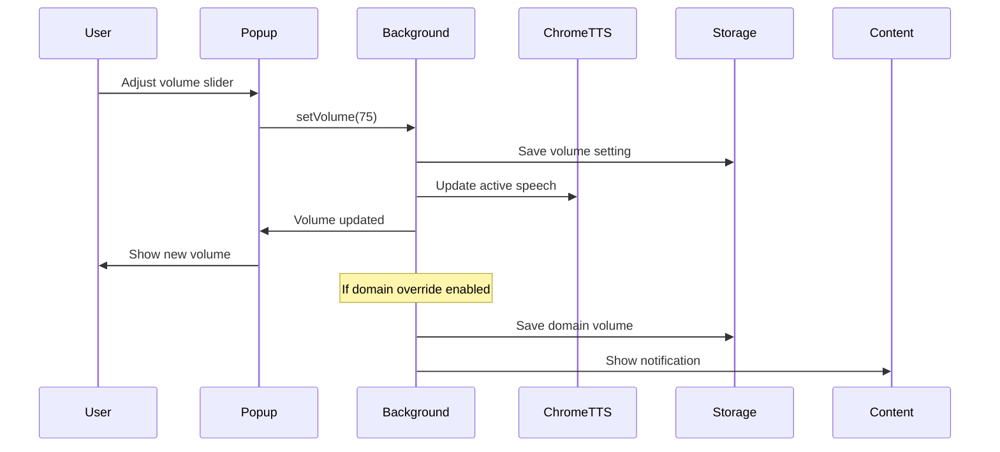

# Feature Specification: Volume Control

**Feature ID**: FEATURE-VOLUME-CONTROL  
**Version**: 1.0  
**Last Updated**: 2025-07-02  
**Status**: DRAFT  
**Priority**: HIGH  
**Estimated Effort**: 3-4 days  

## 1. Feature Overview

### 1.1 Description
The Volume Control feature provides users with independent control over text-to-speech volume levels, separate from system volume. This allows users to fine-tune TTS output volume without affecting other audio sources, with visual feedback, smooth transitions, and persistent settings across sessions.

### 1.2 Business Value
- **Enhanced User Experience**: Users can adjust TTS volume without affecting music, videos, or system sounds
- **Accessibility**: Critical for users with hearing impairments who need different volume levels for TTS
- **Professional Use**: Enables discreet TTS usage in office environments
- **Multi-tasking Support**: Allows balanced audio when using TTS alongside other media

### 1.3 Scope
- Independent volume control slider (0-100%)
- Real-time volume adjustment during playback
- Visual volume indicators and feedback
- Persistent volume preferences per domain
- Smooth volume transitions and fading
- Keyboard shortcuts for volume control

## 2. User Stories

### 2.1 Primary User Stories

**US-001: Basic Volume Control via Popup**
```
As a user listening to text-to-speech,
I want to adjust the TTS volume using a slider in the popup,
So that I can set a comfortable listening level without changing my system volume.

Acceptance Criteria:
- Volume slider visible in popup (0-100% range)
- Moving slider immediately changes TTS volume
- Current volume level clearly displayed
- Changes apply to active playback instantly
- Volume persists across extension sessions
```

**US-002: Real-time Volume Adjustment**
```
As a user currently listening to TTS,
I want to change the volume while speech is playing,
So that I can find the perfect volume without stopping and restarting.

Acceptance Criteria:
- Volume changes apply smoothly during active speech
- No audio artifacts or pops during adjustment
- Visual feedback shows current volume level
- Smooth transition between volume levels
- No interruption to speech flow
```

**US-003: Domain-Specific Volume Memory**
```
As a user who visits different types of websites,
I want the extension to remember my preferred volume for each site,
So that I don't have to readjust volume when switching between sites.

Acceptance Criteria:
- Volume settings saved per domain
- Automatic volume adjustment on domain change
- Option to use global volume instead
- Clear indication of domain-specific settings
- Easy reset to default option
```

### 2.2 Secondary User Stories

**US-004: Keyboard Volume Control**
```
As a power user,
I want to control TTS volume using keyboard shortcuts,
So that I can quickly adjust volume without opening the popup.

Acceptance Criteria:
- Volume up/down keyboard shortcuts
- Configurable increment size (5% or 10%)
- Visual feedback for keyboard adjustments
- Shortcuts work during active playback
```

**US-005: Volume Presets**
```
As a user with specific listening scenarios,
I want to save and quickly switch between volume presets,
So that I can adapt to different environments quickly.

Acceptance Criteria:
- Save current volume as preset
- Quick preset selection buttons
- Named presets (e.g., "Office", "Home", "Quiet")
- Maximum of 5 presets
```

**US-006: Mute Toggle**
```
As a user who gets interrupted,
I want to quickly mute/unmute TTS,
So that I can silence it instantly when needed.

Acceptance Criteria:
- Dedicated mute button
- Keyboard shortcut for mute
- Visual mute indicator
- Volume slider shows muted state
- Unmute returns to previous volume
```

## 3. Technical Requirements

### 3.1 System Architecture

```typescript
// Core volume control interfaces
interface VolumeState {
  globalVolume: number; // 0-100
  isMuted: boolean;
  previousVolume: number; // For unmute
  domainOverrides: Map<string, number>;
  volumePresets: VolumePreset[];
  fadeSettings: FadeSettings;
}

interface VolumePreset {
  id: string;
  name: string;
  volume: number;
  isDefault?: boolean;
}

interface FadeSettings {
  enableFadeIn: boolean;
  enableFadeOut: boolean;
  fadeDuration: number; // milliseconds
}

// Service interface
interface IVolumeControlService {
  setVolume(volume: number, options?: SetVolumeOptions): Promise<void>;
  getVolume(): number;
  getCurrentEffectiveVolume(domain?: string): number;
  mute(): void;
  unmute(): void;
  isMuted(): boolean;
  setDomainVolume(domain: string, volume: number): Promise<void>;
  savePreset(name: string, volume?: number): Promise<string>;
  applyPreset(presetId: string): Promise<void>;
  fadeIn(duration?: number): Promise<void>;
  fadeOut(duration?: number): Promise<void>;
}

interface SetVolumeOptions {
  smooth?: boolean;
  duration?: number;
  saveToDomain?: boolean;
}
```

### 3.2 Chrome API Requirements
- **chrome.tts.speak()**: Volume parameter (0.0 - 1.0)
- **chrome.storage.sync**: Persist volume settings
- **chrome.storage.local**: Cache domain-specific volumes
- **chrome.commands**: Keyboard shortcut handling
- **chrome.tabs**: Domain detection for per-site volumes

### 3.3 Component Integration

**Background Service Worker**
- Manages global volume state
- Applies volume to TTS API calls
- Handles domain-specific volume logic
- Manages volume transitions and fading
- Persists settings to storage

**Content Script**
- Displays volume change notifications
- Handles keyboard shortcuts
- Reports current domain to background

**Popup Interface**
- Volume slider component
- Mute toggle button
- Volume percentage display
- Preset buttons
- Domain override indicator

### 3.4 Data Flow



## 4. Implementation Details

### 4.1 Background Service Implementation

```typescript
// src/background/services/volume-control.service.ts
export class VolumeControlService implements IVolumeControlService {
  private state: VolumeState = {
    globalVolume: 70,
    isMuted: false,
    previousVolume: 70,
    domainOverrides: new Map(),
    volumePresets: this.getDefaultPresets(),
    fadeSettings: {
      enableFadeIn: true,
      enableFadeOut: true,
      fadeDuration: 500
    }
  };

  private activeSpeechId?: number;
  private fadeInterval?: number;

  async setVolume(volume: number, options: SetVolumeOptions = {}): Promise<void> {
    // Validate volume range
    volume = Math.max(0, Math.min(100, volume));

    const oldVolume = this.state.globalVolume;
    this.state.globalVolume = volume;
    this.state.isMuted = false;

    // Save to appropriate storage
    if (options.saveToDomain) {
      const domain = await this.getCurrentDomain();
      if (domain) {
        this.state.domainOverrides.set(domain, volume);
        await this.saveDomainOverrides();
      }
    }

    // Apply volume change
    if (options.smooth && this.isCurrentlySpeaking()) {
      await this.smoothVolumeTransition(oldVolume, volume, options.duration || 300);
    } else {
      await this.applyVolumeToActiveSpeech(volume);
    }

    // Persist state
    await this.saveVolumeState();
    
    // Broadcast change
    await this.broadcastVolumeChange(volume);
  }

  private async smoothVolumeTransition(
    fromVolume: number, 
    toVolume: number, 
    duration: number
  ): Promise<void> {
    const steps = 20;
    const stepDuration = duration / steps;
    const volumeStep = (toVolume - fromVolume) / steps;

    return new Promise((resolve) => {
      let currentStep = 0;
      
      this.fadeInterval = window.setInterval(async () => {
        currentStep++;
        const currentVolume = fromVolume + (volumeStep * currentStep);
        
        await this.applyVolumeToActiveSpeech(currentVolume);
        
        if (currentStep >= steps) {
          clearInterval(this.fadeInterval);
          this.fadeInterval = undefined;
          resolve();
        }
      }, stepDuration);
    });
  }

  private async applyVolumeToActiveSpeech(volume: number): Promise<void> {
    if (!this.isCurrentlySpeaking()) return;

    // Chrome TTS expects 0.0 - 1.0 range
    const chromeVolume = volume / 100;

    // For active speech, we need to stop and restart with new volume
    // Chrome TTS doesn't support dynamic volume changes
    const currentState = await this.getCurrentSpeechState();
    if (currentState) {
      await this.restartSpeechWithVolume(currentState, chromeVolume);
    }
  }

  getCurrentEffectiveVolume(domain?: string): number {
    if (this.state.isMuted) return 0;

    // Check for domain override
    if (domain || (domain = this.getCurrentDomainSync())) {
      const domainVolume = this.state.domainOverrides.get(domain);
      if (domainVolume !== undefined) {
        return domainVolume;
      }
    }

    return this.state.globalVolume;
  }

  mute(): void {
    if (!this.state.isMuted) {
      this.state.previousVolume = this.state.globalVolume;
      this.state.isMuted = true;
      this.setVolume(0, { smooth: true, duration: 100 });
    }
  }

  unmute(): void {
    if (this.state.isMuted) {
      this.state.isMuted = false;
      this.setVolume(this.state.previousVolume, { smooth: true, duration: 100 });
    }
  }

  async fadeIn(duration?: number): Promise<void> {
    const fadeDuration = duration || this.state.fadeSettings.fadeDuration;
    const targetVolume = this.getCurrentEffectiveVolume();
    
    // Start from 0 and fade to target
    await this.setVolume(0, { smooth: false });
    await this.smoothVolumeTransition(0, targetVolume, fadeDuration);
  }

  async fadeOut(duration?: number): Promise<void> {
    const fadeDuration = duration || this.state.fadeSettings.fadeDuration;
    const currentVolume = this.getCurrentEffectiveVolume();
    
    // Fade from current to 0
    await this.smoothVolumeTransition(currentVolume, 0, fadeDuration);
  }

  private getDefaultPresets(): VolumePreset[] {
    return [
      { id: 'quiet', name: 'Quiet', volume: 30 },
      { id: 'normal', name: 'Normal', volume: 70, isDefault: true },
      { id: 'loud', name: 'Loud', volume: 90 },
      { id: 'office', name: 'Office', volume: 50 },
      { id: 'headphones', name: 'Headphones', volume: 60 }
    ];
  }

  private async broadcastVolumeChange(volume: number): Promise<void> {
    // Notify all components
    chrome.runtime.sendMessage({
      type: 'VOLUME_CHANGED',
      volume,
      isMuted: this.state.isMuted,
      effectiveVolume: this.getCurrentEffectiveVolume()
    });

    // Update popup if open
    const views = chrome.extension.getViews({ type: 'popup' });
    views.forEach(view => {
      view.postMessage({
        type: 'VOLUME_UPDATE',
        state: this.state
      });
    });
  }
}
```

### 4.2 Popup UI Implementation

```tsx
// src/popup/components/VolumeControl.tsx
import React, { useState, useEffect, useCallback, useRef } from 'react';
import { VolumeIcon, VolumeOffIcon } from '@heroicons/react/24/solid';

interface VolumeControlProps {
  onVolumeChange?: (volume: number) => void;
}

export const VolumeControl: React.FC<VolumeControlProps> = ({ onVolumeChange }) => {
  const [volume, setVolume] = useState(70);
  const [isMuted, setIsMuted] = useState(false);
  const [isDragging, setIsDragging] = useState(false);
  const [showTooltip, setShowTooltip] = useState(false);
  const [domainVolume, setDomainVolume] = useState<number | null>(null);
  const sliderRef = useRef<HTMLInputElement>(null);

  useEffect(() => {
    // Load initial volume state
    chrome.runtime.sendMessage({ type: 'GET_VOLUME_STATE' }, (response) => {
      if (response) {
        setVolume(response.volume);
        setIsMuted(response.isMuted);
        setDomainVolume(response.domainVolume);
      }
    });

    // Listen for volume changes
    const handleMessage = (message: any) => {
      if (message.type === 'VOLUME_CHANGED') {
        setVolume(message.volume);
        setIsMuted(message.isMuted);
      }
    };

    chrome.runtime.onMessage.addListener(handleMessage);
    return () => chrome.runtime.onMessage.removeListener(handleMessage);
  }, []);

  const handleVolumeChange = useCallback((newVolume: number) => {
    setVolume(newVolume);
    
    // Debounced save
    chrome.runtime.sendMessage({
      type: 'SET_VOLUME',
      volume: newVolume,
      options: { smooth: true, saveToDomain: false }
    });

    onVolumeChange?.(newVolume);
  }, [onVolumeChange]);

  const handleMuteToggle = useCallback(() => {
    const action = isMuted ? 'UNMUTE' : 'MUTE';
    chrome.runtime.sendMessage({ type: action });
    setIsMuted(!isMuted);
  }, [isMuted]);

  const handleSliderMouseDown = () => {
    setIsDragging(true);
    setShowTooltip(true);
  };

  const handleSliderMouseUp = () => {
    setIsDragging(false);
    setShowTooltip(false);
    
    // Save to domain if enabled
    if (domainVolume !== null) {
      chrome.runtime.sendMessage({
        type: 'SET_VOLUME',
        volume,
        options: { saveToDomain: true }
      });
    }
  };

  const getVolumeIcon = () => {
    if (isMuted || volume === 0) return VolumeOffIcon;
    return VolumeIcon;
  };

  const VolumeIconComponent = getVolumeIcon();

  return (
    <div className="volume-control p-4">
      <div className="flex items-center gap-3">
        {/* Mute Button */}
        <button
          className="btn btn-circle btn-sm"
          onClick={handleMuteToggle}
          aria-label={isMuted ? 'Unmute' : 'Mute'}
        >
          <VolumeIconComponent className="w-5 h-5" />
        </button>

        {/* Volume Slider */}
        <div className="flex-1 relative">
          <input
            ref={sliderRef}
            type="range"
            min="0"
            max="100"
            value={isMuted ? 0 : volume}
            onChange={(e) => handleVolumeChange(Number(e.target.value))}
            onMouseDown={handleSliderMouseDown}
            onMouseUp={handleSliderMouseUp}
            onTouchStart={handleSliderMouseDown}
            onTouchEnd={handleSliderMouseUp}
            className="range range-primary range-sm"
            disabled={isMuted}
            aria-label="Volume"
          />
          
          {/* Volume Percentage Tooltip */}
          {showTooltip && (
            <div 
              className="absolute -top-8 left-1/2 transform -translate-x-1/2 
                         bg-base-200 text-xs px-2 py-1 rounded shadow-lg"
              style={{ left: `${volume}%` }}
            >
              {volume}%
            </div>
          )}
          
          {/* Volume Level Indicators */}
          <div className="flex justify-between text-xs mt-1 text-base-content/50">
            <span>0</span>
            <span>50</span>
            <span>100</span>
          </div>
        </div>

        {/* Volume Percentage Display */}
        <div className="text-sm font-medium w-12 text-right">
          {isMuted ? '---' : `${volume}%`}
        </div>
      </div>

      {/* Domain-specific indicator */}
      {domainVolume !== null && (
        <div className="mt-2 text-xs text-base-content/70 flex items-center gap-1">
          <span className="badge badge-sm badge-primary">Domain</span>
          <span>Volume set for this site</span>
        </div>
      )}

      {/* Preset Buttons */}
      <div className="mt-3 flex gap-2">
        <button 
          className="btn btn-xs"
          onClick={() => handleVolumeChange(30)}
        >
          Quiet
        </button>
        <button 
          className="btn btn-xs"
          onClick={() => handleVolumeChange(70)}
        >
          Normal
        </button>
        <button 
          className="btn btn-xs"
          onClick={() => handleVolumeChange(90)}
        >
          Loud
        </button>
      </div>
    </div>
  );
};
```

### 4.3 Keyboard Shortcut Handler

```typescript
// src/content/volume-shortcuts.ts
export class VolumeShortcutHandler {
  private volumeStep = 10; // 10% increments
  private lastVolumeChangeTime = 0;
  private volumeNotification: HTMLElement | null = null;

  initialize() {
    // Register Chrome commands
    chrome.commands.onCommand.addListener(this.handleCommand);
    
    // Listen for keyboard events
    document.addEventListener('keydown', this.handleKeyPress);
  }

  private handleCommand = (command: string) => {
    switch (command) {
      case 'volume-up':
        this.adjustVolume(this.volumeStep);
        break;
      case 'volume-down':
        this.adjustVolume(-this.volumeStep);
        break;
      case 'toggle-mute':
        this.toggleMute();
        break;
    }
  };

  private handleKeyPress = (event: KeyboardEvent) => {
    // Only handle if extension has focus or with modifier key
    if (!event.ctrlKey || !event.shiftKey) return;

    switch (event.key) {
      case 'ArrowUp':
        event.preventDefault();
        this.adjustVolume(this.volumeStep);
        break;
      case 'ArrowDown':
        event.preventDefault();
        this.adjustVolume(-this.volumeStep);
        break;
      case 'm':
      case 'M':
        event.preventDefault();
        this.toggleMute();
        break;
    }
  };

  private async adjustVolume(delta: number) {
    // Rate limit volume changes
    const now = Date.now();
    if (now - this.lastVolumeChangeTime < 100) return;
    this.lastVolumeChangeTime = now;

    try {
      const response = await chrome.runtime.sendMessage({
        type: 'ADJUST_VOLUME',
        delta
      });

      if (response.success) {
        this.showVolumeNotification(response.newVolume, response.isMuted);
      }
    } catch (error) {
      console.error('Volume adjustment failed:', error);
    }
  }

  private async toggleMute() {
    try {
      const response = await chrome.runtime.sendMessage({
        type: 'TOGGLE_MUTE'
      });

      if (response.success) {
        this.showVolumeNotification(
          response.volume, 
          response.isMuted,
          response.isMuted ? 'Muted' : 'Unmuted'
        );
      }
    } catch (error) {
      console.error('Mute toggle failed:', error);
    }
  }

  private showVolumeNotification(
    volume: number, 
    isMuted: boolean, 
    message?: string
  ) {
    // Remove existing notification
    if (this.volumeNotification) {
      this.volumeNotification.remove();
    }

    // Create new notification
    this.volumeNotification = document.createElement('div');
    this.volumeNotification.className = 'tts-volume-notification';
    
    // Volume bar visualization
    const volumeBar = this.createVolumeBar(volume, isMuted);
    
    this.volumeNotification.innerHTML = `
      <div class="volume-icon">${isMuted ? '🔇' : '🔊'}</div>
      <div class="volume-bar-container">
        ${volumeBar}
      </div>
      <div class="volume-text">${message || `${volume}%`}</div>
    `;

    // Style the notification
    this.volumeNotification.style.cssText = `
      position: fixed;
      top: 20px;
      right: 20px;
      background: rgba(0, 0, 0, 0.8);
      color: white;
      padding: 12px 20px;
      border-radius: 8px;
      display: flex;
      align-items: center;
      gap: 10px;
      z-index: 999999;
      animation: slideIn 0.3s ease-out;
    `;

    document.body.appendChild(this.volumeNotification);

    // Auto-remove after delay
    setTimeout(() => {
      if (this.volumeNotification) {
        this.volumeNotification.style.animation = 'slideOut 0.3s ease-in';
        setTimeout(() => {
          this.volumeNotification?.remove();
          this.volumeNotification = null;
        }, 300);
      }
    }, 2000);
  }

  private createVolumeBar(volume: number, isMuted: boolean): string {
    const segments = 10;
    const filledSegments = Math.round((volume / 100) * segments);
    
    let bar = '<div style="display: flex; gap: 2px;">';
    for (let i = 0; i < segments; i++) {
      const isFilled = i < filledSegments && !isMuted;
      const color = isMuted ? '#666' : (isFilled ? '#4ade80' : '#333');
      bar += `<div style="width: 3px; height: 12px; background: ${color};"></div>`;
    }
    bar += '</div>';
    
    return bar;
  }
}
```

## 5. Acceptance Criteria

### 5.1 Functional Criteria

**AC-001: Volume Control Range**
- [ ] Volume slider supports 0-100% range
- [ ] Each increment represents 1% change
- [ ] Smooth slider movement without jumps
- [ ] Current volume clearly displayed
- [ ] Visual feedback during adjustment

**AC-002: Real-time Volume Changes**
- [ ] Volume changes apply immediately during playback
- [ ] No audio artifacts or distortion
- [ ] Smooth volume transitions (no pops/clicks)
- [ ] Changes persist across sessions
- [ ] Works with all voice types

**AC-003: Independent from System Volume**
- [ ] TTS volume separate from system volume
- [ ] System volume changes don't affect TTS
- [ ] TTS volume relative to system volume
- [ ] Clear documentation of volume relationship
- [ ] No conflicts with system audio

**AC-004: Mute Functionality**
- [ ] Instant mute with single click
- [ ] Visual indicator for muted state
- [ ] Unmute returns to previous volume
- [ ] Mute state persists appropriately
- [ ] Keyboard shortcut for mute toggle

**AC-005: Domain-Specific Volumes**
- [ ] Volume saved per domain when enabled
- [ ] Automatic volume switch on navigation
- [ ] Clear indicator of domain override
- [ ] Option to disable domain volumes
- [ ] Limit of 100 domain entries

### 5.2 Performance Criteria

**AC-006: Response Time**
- [ ] Volume changes apply within 50ms
- [ ] Smooth transitions complete in 300ms
- [ ] No UI lag during adjustment
- [ ] Instant mute/unmute response
- [ ] Efficient storage operations

**AC-007: Audio Quality**
- [ ] No distortion at any volume level
- [ ] Clean audio at 0% and 100%
- [ ] Smooth fade in/out transitions
- [ ] No clipping or artifacts
- [ ] Consistent quality across voices

## 6. Test Cases

### 6.1 Unit Tests

```typescript
// tests/unit/volume-control.service.test.ts
describe('VolumeControlService', () => {
  let service: VolumeControlService;
  let mockStorage: jest.Mocked<chrome.storage.StorageArea>;

  beforeEach(() => {
    mockStorage = createMockStorage();
    service = new VolumeControlService();
  });

  describe('setVolume()', () => {
    it('should clamp volume to 0-100 range', async () => {
      await service.setVolume(150);
      expect(service.getVolume()).toBe(100);

      await service.setVolume(-50);
      expect(service.getVolume()).toBe(0);
    });

    it('should apply smooth transitions when requested', async () => {
      const spy = jest.spyOn(service as any, 'smoothVolumeTransition');
      
      await service.setVolume(80, { smooth: true, duration: 200 });
      
      expect(spy).toHaveBeenCalledWith(70, 80, 200);
    });

    it('should save domain override when specified', async () => {
      const domain = 'example.com';
      jest.spyOn(service as any, 'getCurrentDomain').mockResolvedValue(domain);

      await service.setVolume(60, { saveToDomain: true });

      expect(service.getCurrentEffectiveVolume(domain)).toBe(60);
      expect(mockStorage.set).toHaveBeenCalledWith(
        expect.objectContaining({
          domainVolumes: expect.any(Object)
        })
      );
    });

    it('should unmute when setting volume', async () => {
      service.mute();
      expect(service.isMuted()).toBe(true);

      await service.setVolume(50);
      expect(service.isMuted()).toBe(false);
    });
  });

  describe('mute/unmute', () => {
    it('should mute and preserve previous volume', () => {
      service.setVolume(75);
      service.mute();

      expect(service.isMuted()).toBe(true);
      expect(service.getVolume()).toBe(0);
      expect((service as any).state.previousVolume).toBe(75);
    });

    it('should restore previous volume on unmute', () => {
      service.setVolume(80);
      service.mute();
      service.unmute();

      expect(service.isMuted()).toBe(false);
      expect(service.getVolume()).toBe(80);
    });

    it('should not double-mute', () => {
      service.setVolume(60);
      service.mute();
      service.mute(); // Second mute

      service.unmute();
      expect(service.getVolume()).toBe(60); // Should restore original
    });
  });

  describe('domain-specific volumes', () => {
    it('should return domain volume when available', () => {
      service.setVolume(70); // Global
      (service as any).state.domainOverrides.set('example.com', 50);

      expect(service.getCurrentEffectiveVolume('example.com')).toBe(50);
      expect(service.getCurrentEffectiveVolume('other.com')).toBe(70);
    });

    it('should respect mute state for domain volumes', () => {
      (service as any).state.domainOverrides.set('example.com', 80);
      service.mute();

      expect(service.getCurrentEffectiveVolume('example.com')).toBe(0);
    });
  });

  describe('fade effects', () => {
    it('should fade in from 0 to target volume', async () => {
      service.setVolume(60);
      const spy = jest.spyOn(service as any, 'smoothVolumeTransition');

      await service.fadeIn(500);

      expect(spy).toHaveBeenCalledWith(0, 60, 500);
    });

    it('should fade out from current to 0', async () => {
      service.setVolume(80);
      const spy = jest.spyOn(service as any, 'smoothVolumeTransition');

      await service.fadeOut(300);

      expect(spy).toHaveBeenCalledWith(80, 0, 300);
    });
  });
});
```

### 6.2 Integration Tests

```typescript
// tests/integration/volume-control-flow.test.ts
describe('Volume Control Integration', () => {
  let extension: ChromeExtension;

  beforeEach(async () => {
    extension = await loadExtension();
  });

  it('should adjust volume during active playback', async () => {
    // Start TTS
    await extension.startReading('Testing volume control functionality.');
    await waitFor(() => extension.isSpeaking());

    // Adjust volume via popup
    await extension.popup.setVolume(50);
    
    // Verify volume changed
    const state = await extension.getVolumeState();
    expect(state.volume).toBe(50);
    
    // Verify still speaking (no interruption)
    expect(await extension.isSpeaking()).toBe(true);
  });

  it('should handle keyboard volume controls', async () => {
    await extension.startReading('Testing keyboard shortcuts.');

    // Press volume up
    await extension.pressKeys('Ctrl+Shift+ArrowUp');
    let state = await extension.getVolumeState();
    expect(state.volume).toBe(80); // 70 + 10

    // Press volume down twice
    await extension.pressKeys('Ctrl+Shift+ArrowDown');
    await extension.pressKeys('Ctrl+Shift+ArrowDown');
    state = await extension.getVolumeState();
    expect(state.volume).toBe(60); // 80 - 20
  });

  it('should persist volume across sessions', async () => {
    // Set volume
    await extension.popup.setVolume(45);
    
    // Reload extension
    await extension.reload();
    
    // Check volume persisted
    const state = await extension.getVolumeState();
    expect(state.volume).toBe(45);
  });

  it('should handle domain-specific volumes', async () => {
    // Navigate to first domain
    await extension.navigateTo('https://example.com');
    await extension.popup.setVolume(30, { saveToDomain: true });

    // Navigate to second domain
    await extension.navigateTo('https://test.com');
    await extension.popup.setVolume(80, { saveToDomain: true });

    // Return to first domain
    await extension.navigateTo('https://example.com');
    const state = await extension.getVolumeState();
    expect(state.effectiveVolume).toBe(30);

    // Check second domain
    await extension.navigateTo('https://test.com');
    const state2 = await extension.getVolumeState();
    expect(state2.effectiveVolume).toBe(80);
  });

  it('should handle mute/unmute flow', async () => {
    await extension.startReading('Testing mute functionality.');
    await extension.popup.setVolume(70);

    // Mute
    await extension.popup.clickMuteButton();
    expect(await extension.getVolumeState()).toMatchObject({
      volume: 0,
      isMuted: true,
      previousVolume: 70
    });

    // Unmute
    await extension.popup.clickMuteButton();
    expect(await extension.getVolumeState()).toMatchObject({
      volume: 70,
      isMuted: false
    });
  });
});
```

### 6.3 E2E Test Scenarios

**E2E-001: Complete Volume Control Flow**
1. Install extension fresh
2. Navigate to article page
3. Start TTS playback
4. Open popup while speaking
5. Drag volume slider to 30%
6. Verify audio volume decreased
7. Click mute button
8. Verify audio muted instantly
9. Click unmute
10. Verify volume returns to 30%
11. Use keyboard to increase to 50%
12. Verify smooth transition

**E2E-002: Multi-Domain Volume Management**
1. Navigate to news.com
2. Set volume to 40% with domain save
3. Navigate to docs.com
4. Set volume to 80% with domain save
5. Navigate to blog.com (no domain setting)
6. Verify global volume used (70%)
7. Return to news.com
8. Verify volume auto-adjusts to 40%
9. Clear domain setting
10. Verify returns to global volume

**E2E-003: Volume Persistence and Presets**
1. Set volume to 55%
2. Close and reopen popup
3. Verify volume still 55%
4. Click "Quiet" preset
5. Verify volume changes to 30%
6. Restart browser
7. Open extension
8. Verify volume persisted at 30%

## 7. UI/UX Specifications

### 7.1 Visual Design

**Volume Slider Design**
```css
/* Volume slider styling */
.volume-slider {
  --slider-height: 6px;
  --thumb-size: 18px;
  --track-color: #e5e7eb;
  --fill-color: #3b82f6;
  --thumb-color: #2563eb;
}

.volume-slider::-webkit-slider-track {
  height: var(--slider-height);
  background: var(--track-color);
  border-radius: 3px;
}

.volume-slider::-webkit-slider-thumb {
  width: var(--thumb-size);
  height: var(--thumb-size);
  background: var(--thumb-color);
  border-radius: 50%;
  cursor: pointer;
  transition: transform 0.2s;
}

.volume-slider::-webkit-slider-thumb:hover {
  transform: scale(1.1);
  box-shadow: 0 0 0 8px rgba(59, 130, 246, 0.1);
}

/* Muted state */
.volume-slider.muted {
  --fill-color: #9ca3af;
  --thumb-color: #6b7280;
  opacity: 0.7;
}
```

**Volume Notification Styles**
```css
@keyframes slideIn {
  from {
    transform: translateX(100%);
    opacity: 0;
  }
  to {
    transform: translateX(0);
    opacity: 1;
  }
}

@keyframes slideOut {
  from {
    transform: translateX(0);
    opacity: 1;
  }
  to {
    transform: translateX(100%);
    opacity: 0;
  }
}

.tts-volume-notification {
  backdrop-filter: blur(10px);
  box-shadow: 0 4px 12px rgba(0, 0, 0, 0.3);
  user-select: none;
  pointer-events: none;
}

.volume-bar-segment {
  transition: background-color 0.15s ease;
}
```

### 7.2 Interaction Patterns

**Slider Interactions**
- Click on track: Jump to position
- Drag thumb: Smooth adjustment with live preview
- Mouse wheel: 5% increments when hovering
- Double-click: Reset to default (70%)
- Right-click: Open preset menu

**Keyboard Controls**
```
[Ctrl+Shift+↑] Volume Up (+10%)
[Ctrl+Shift+↓] Volume Down (-10%)
[Ctrl+Shift+M] Toggle Mute
[Ctrl+Shift+0] Mute
[Ctrl+Shift+1-9] Set to 10%-90%
```

### 7.3 Responsive Behavior

**Popup Layout**
- Mobile (< 350px): Vertical layout, larger touch targets
- Desktop (≥ 350px): Horizontal layout, standard controls
- Touch devices: Increased thumb size (24px)
- High DPI: Crisp rendering with vector icons

**Accessibility Features**
- ARIA labels for all controls
- Keyboard navigation support
- Screen reader announcements
- High contrast mode support
- Focus indicators

## 8. Error Handling

### 8.1 Error Scenarios

**ERR-001: Volume Setting Failure**
```typescript
try {
  await chrome.tts.speak(text, { volume: chromeVolume });
} catch (error) {
  if (error.message.includes('Invalid volume')) {
    // Fallback to safe volume
    console.warn('Invalid volume, using default:', error);
    await chrome.tts.speak(text, { volume: 0.7 });
  } else {
    throw new Error('Failed to set volume. Please try again.');
  }
}
```

**ERR-002: Storage Quota Exceeded**
```typescript
try {
  await chrome.storage.sync.set({ volumeSettings });
} catch (error) {
  if (error.message.includes('QUOTA_BYTES')) {
    // Clear old domain volumes
    await this.pruneOldDomainVolumes();
    // Retry with reduced data
    await chrome.storage.sync.set({ 
      volumeSettings: this.getEssentialSettings() 
    });
  }
}
```

**ERR-003: Audio Context Failure**
```typescript
if (!this.audioContext || this.audioContext.state === 'closed') {
  try {
    this.audioContext = new AudioContext();
    await this.audioContext.resume();
  } catch (error) {
    // Fallback to Chrome TTS volume only
    console.error('Audio context failed, using TTS API only');
    this.useAudioContext = false;
  }
}
```

### 8.2 User-Facing Error Messages

| Error Code | User Message | Recovery Action |
|------------|--------------|-----------------|
| E001 | "Unable to adjust volume. Please try again." | Retry button |
| E002 | "Volume settings storage full. Clear old settings?" | Clear/Cancel |
| E003 | "Audio system busy. Volume may not update immediately." | OK |
| E004 | "Volume preset failed to save." | Try Again |
| E005 | "Domain volume limit reached (100 sites max)." | Manage Sites |

### 8.3 Graceful Degradation

```typescript
class VolumeControlFallback {
  async setVolume(volume: number): Promise<void> {
    try {
      // Try advanced volume control
      await this.advancedVolumeControl(volume);
    } catch (error) {
      console.warn('Advanced volume failed, using basic:', error);
      
      try {
        // Fallback to basic Chrome TTS volume
        await this.basicVolumeControl(volume);
      } catch (fallbackError) {
        console.error('All volume methods failed:', fallbackError);
        // Continue with last known good volume
        this.notifyVolumeFailure();
      }
    }
  }

  private notifyVolumeFailure(): void {
    // Show non-intrusive notification
    chrome.runtime.sendMessage({
      type: 'SHOW_NOTIFICATION',
      message: 'Volume adjustment unavailable',
      severity: 'warning',
      duration: 3000
    });
  }
}
```

## 9. Dependencies

### 9.1 External Dependencies
- **Chrome TTS API**: Volume parameter support
- **Chrome Storage Sync API**: Settings persistence (4KB limit)
- **Chrome Storage Local API**: Domain volume cache
- **Chrome Commands API**: Keyboard shortcuts
- **Web Audio API**: Advanced volume control (optional)

### 9.2 Internal Dependencies
- **SpeechSynthesizer**: Integration with TTS engine
- **StorageService**: Centralized storage management
- **MessageHandler**: Cross-component communication
- **UIStateManager**: Popup state synchronization

### 9.3 Feature Dependencies
- **Feature-2.1**: Basic TTS (required)
- **Feature-2.2**: Voice Selection (integrated)
- **Storage System**: For persistence

### 9.4 Optional Enhancements
- **Web Audio API**: For advanced audio processing
- **AudioContext**: For precise volume control
- **GainNode**: For smooth transitions

## 10. Performance Considerations

### 10.1 Optimization Strategies
- Debounce volume changes (50ms)
- Batch storage operations (500ms)
- Limit smooth transitions to 20 steps
- Use RAF for animation timing
- Cache domain lookups

### 10.2 Memory Management
- Limit domain volume entries to 100
- Prune unused entries after 30 days
- Volume state object < 500 bytes
- Clear transition intervals properly

### 10.3 Battery Efficiency
- Minimize continuous animations
- Use CSS transitions where possible
- Suspend updates when hidden
- Reduce polling during idle

## 11. Accessibility

### 11.1 ARIA Support
```html
<input 
  type="range"
  role="slider"
  aria-label="Text-to-speech volume"
  aria-valuemin="0"
  aria-valuemax="100"
  aria-valuenow="70"
  aria-valuetext="70 percent"
/>
```

### 11.2 Keyboard Navigation
- Tab: Navigate between controls
- Arrow keys: Adjust slider
- Space/Enter: Toggle mute
- Escape: Close volume panel
- Numbers 0-9: Quick volume set

### 11.3 Screen Reader Announcements
- Volume changes: "Volume set to 50 percent"
- Mute toggle: "Muted" / "Unmuted"
- Domain volume: "Volume for this site: 60 percent"
- Preset selection: "Quiet preset selected, 30 percent"

## 12. Future Enhancements

### 12.1 Advanced Features
- Volume normalization across voices
- Auto-volume based on ambient noise
- Per-voice volume preferences
- Volume ducking for notifications
- Equalizer integration

### 12.2 Smart Features
- ML-based volume recommendations
- Time-of-day volume profiles
- Environment-aware adjustments
- Voice clarity optimization

## 13. Success Metrics

### 13.1 User Engagement
- Volume adjustment usage > 70%
- Domain volume adoption > 30%
- Preset usage > 40%
- Mute feature usage > 50%

### 13.2 Technical Metrics
- Volume change latency < 50ms (P95)
- Smooth transition FPS > 30
- Storage sync success > 99.9%
- Zero audio artifacts

### 13.3 User Satisfaction
- Volume control rating > 4.6/5
- "Just right" volume reports > 85%
- Support tickets < 0.05%
- Feature requests addressed > 90%

## 14. Testing Checklist

### 14.1 Manual Testing
- [ ] Volume slider responds smoothly
- [ ] Mute button toggles correctly
- [ ] Keyboard shortcuts work
- [ ] Domain volumes persist
- [ ] Presets apply correctly
- [ ] Visual feedback appears
- [ ] No audio artifacts
- [ ] Settings save properly

### 14.2 Automated Testing
- [ ] Unit tests pass (> 95% coverage)
- [ ] Integration tests pass
- [ ] E2E tests complete
- [ ] Performance benchmarks met
- [ ] Accessibility tests pass

### 14.3 Cross-Browser Testing
- [ ] Chrome 88+ (primary)
- [ ] Edge (Chromium)
- [ ] Opera (optional)
- [ ] Chrome mobile (future)

## 15. Documentation

### 15.1 User Documentation
- Popup tooltips and hints
- Help page with volume guide
- FAQ for common issues
- Video tutorial demonstration

### 15.2 Developer Documentation
- API reference with examples
- Architecture diagrams
- Integration guide
- Troubleshooting guide

---

**Document Version History**
- v1.0 (2025-07-02): Initial specification created

**Approvals Required**
- [ ] Engineering Lead
- [ ] Product Manager  
- [ ] UX Designer
- [ ] QA Lead